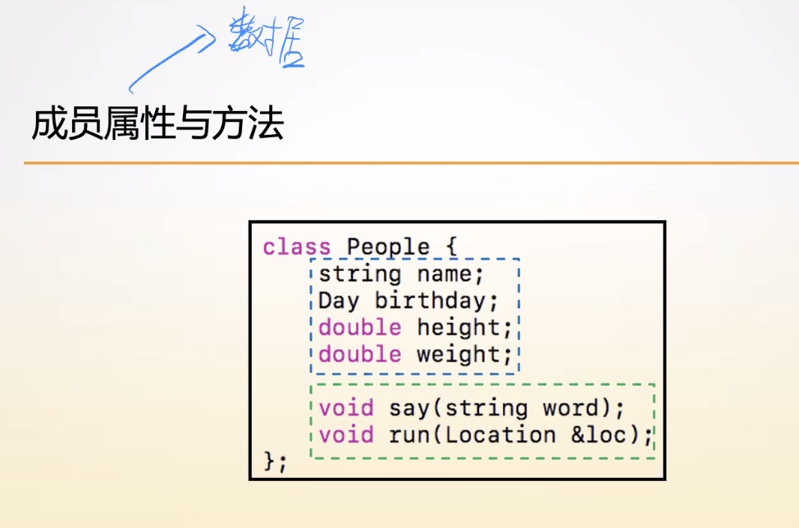
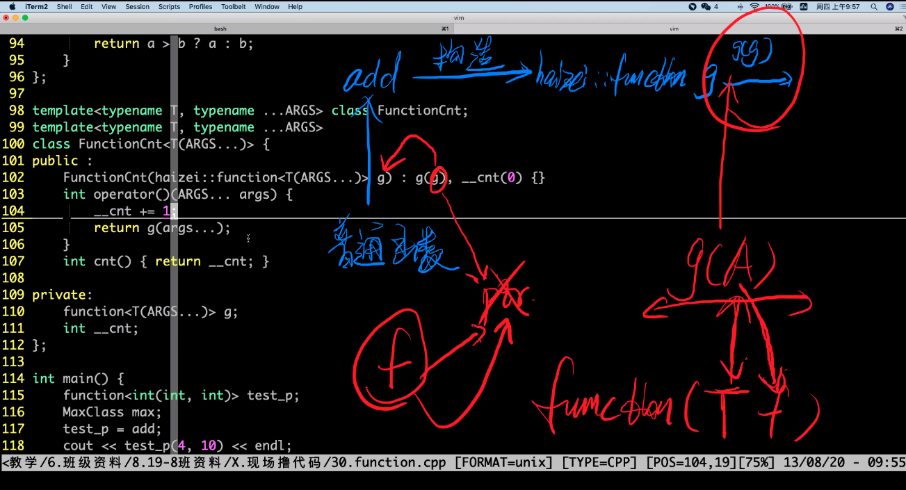
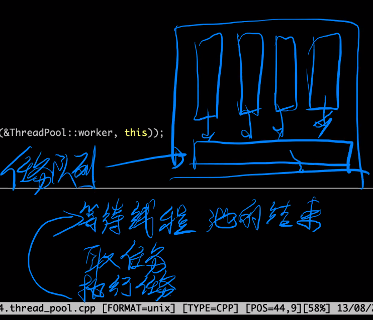
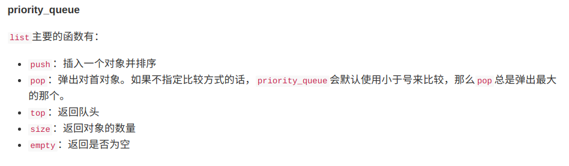

## C++基础

头文件数量为87个

增加了异常处理 

增加了模板， 类对象


四种编程范式

面向对象 面向过程 泛型编程 函数式编程 

学习语言的特点是：编程范式

__提高开发效率__ 

+ 代码开发
+ 测试
+ 维护

## queue类说明

`queue<int> q  queue<float> q`


## stack 类说明


## string 类说明


__C++ 中有string 类，可以像整数一样判断，字符串连接和长度__

c语言中 strlen(str) 时间复杂度为o(n)

c++ str.length() 时间复杂度为o(1) ,str是对象

__一个存s1 一个存长度 所以时间复杂度为o(1)__

## hash_map 类说明(非标准)


标准的功能数据结构等都在std 的命名空间中

hash_func 可以放全部的可调用类型？？？？？

数组下标类型可以是任意类型


非排序映射哈希表实现的   排序映射红黑树实现的


单调队列：最小值  单调栈：当前最大最小值

泛型编程 去掉了类型限定

C 语言有29个头文件

### C++ sort优化

+ 单边递归法
+ 无监督的pattition
+ 快速排序
+ ？ 

#### 第K大元素

常规解法 小顶堆 

 n 大 k 小 小顶堆    o(nlogk)

 n 小 k 小  意味者可以一次存进内存 用快速选择算法  o(n)

__影响快速排序的时间复杂度因素为 基准值的选取策略__

## 类和对象

`类型 <=> 类`    `变量<==>对象`

`类型 = 类型数据 + 类型操作`

`数据结构 = 结构定义 + 结构操作` 




### 访问权限


__friendly 友元函数 可以访问私有成员(private)__

结构体中不能放方法类中可以

## 构造函数与析构函数

使用


__同类型对象进行赋值时 会用到拷贝函数__

## 类属性方法

成员方法访问的特殊变量this指针

> 类具有成员变量和成员方法
>
> 成员变量用来描述某个对象的具体特征，是静态的，也称为成员属性，这些属性一般设置为私有，仅供类的内部使用。
>
> 成员方法用来描述某个对象的具体行为，是动态的，也成为成员函数，这些属性一般设置为共有，方便外部使用此类。

类属性是整个类的一个属性 成员属性是有一个对象成员数行就多一份 所有成员属性分享一个类属性

类属性：所有成员对象都能访问，大家一起共享

__统计某个类的总个数 构造函数函数+1 析构函数-1, 不行数据转换函数， 类访问不了this指针？？？__

## 转换构造函数

匿名对象 c = 5.6 5.6先用默认构造函数，通过另外一个新的匿名对象存储在变成类，达到数据转换的目的

### const 方法

> 加在成员方法后，意味着方法内部不修改对象中任何的属性值
>
> 作用：被const对象进行调用 const类型的对象只能调用const类型的方法

## 返回值优化


## 运算符重载

cin cout 是对象不是方法

istream &operator<<(int &n) n要引用，为了避免拷贝，会导致 

`只能在类内重载 间接引用"->", 小括号"()" 方括号"[]" 赋值运算符`

`不能重载的运算符 直接引用"." ".*","三目运算符","::"`

不能重载的运算符

`.` : 不能重载

 `->`：成员指针访问运算符

  `.`：成员访问运算符

`::`：域运算符

 `sizeof`：长度运算符
 `?:`：条件运算符

重载间接引用的对象 指针对象 

## 浅拷贝深拷贝

```
	A a, b(a);
    a.arr[3] = 9973;
    b.arr[3] = 6687;
    cout << a.arr[3] << endl;
    cout << b.arr[3] << endl;
输出发现两个对象的arr[3]都为2，因为没写拷贝函数，所以b(a)调用的是系统默认的拷贝构造函数，两个对象的arr[3]指向的是同一块存储空间，所以两个值一样,浅拷贝
```

改为深拷贝的办法

```
class A {
public :
    A() {
        arr = new int[10];
    }
    A(const A &a) : A() { //添加以方法，先开辟出空间在复制过来，使两个变量指向不同的存储空间
        for (int i = 0; i < 10; i++) {
            this->arr[i] = a.arr[i];
        }
        this->x = a.x;
        this->y = a.y;
        return ;
    }
    int x, y;
    int *arr;
};
```

## 封装 继承 多态

继承发生在类与类之间

父类的所有的属性和方法都会被包含在子类中 但是父类的private 子类不能访问 

继承权限 ：影响的是外部对于子类从父类继承过来的属性和方法对外的访问权限，只能更底不能更高

父类中的private属性的成员变量 即使子类继承了也不能访问

### 继承子类的访问权限


由图可知，不管访问权限是什么，子类只能访问父类的public 和 protected 属性和方法，不能访问private

__访问权限会改变子类从父类继承而来的属性和方法对外的表现__


例，子类继承父类的继承权限为public时，父类的属性为 public的成员属性在子类中为public protected 继承后为protected 。继承权限为protected时 public和protected成员属性都为protected 、继承权限为private时 public和 protected 属性都为private 。__不管继承权限是什么父类；父类中的private成员属性对子类来说都是不可访问的 __

### 继承构造函数

```
cat() : 初始化列表 {
    构造逻辑
}
当程序执行玩初始化列表时类已经就算是实现完了，当进入到构造逻辑时，初始化列表已经完成了对数据的初始化
初始化列表先执行父类的初始化在执行子类的属性的初始化方法
```


先执行父类的默认构造函数再执行子类的默认构造函数

运行到子类 调用父类的构造函数 调用子类的构造函数 父类完成构造 子类再完成构造

### 菱形继承


__菱形继承会给程序带来灾难性的后果 ， 程序实现时 为了避免 拒绝多重继承  可以实现一个实体类多个接口类__

### 基类与派生类的构造顺序

__基类(父类)先完成构造 派生类(子类)在完成构造__

### 拷贝构造函数--继承

## 实现string类


### overrid关键字 帮助找错覆盖掉上一个虚函数

编译期时状态:运行前就知道 

__运行时状态 ：运行的过程中需要记录一些额外的信息才能去维护运行时状态__

普通成员函数 编译器状态根基类就可确定 如果是虚函数就不能确定是运行是状态

一个严格的纯虚类只能包含虚析构函数和纯虚函数

## virtual

__普通的成员方法跟着类走  虚函数跟着对象走__

static修饰的类方法不能用 virtual static 修饰的是类方法 virtual修饰的是成员方法

>  存没有实现的纯虚函数，那这个基类是不能实例化的。继承这个基类的子类可以覆盖也可以不覆盖其虚函数。如果基类中的纯虚函数在子类中没有覆盖，那这个子类还是一个虚类，不能实例化的。
>
> class A { 
>
> public: 
>
> virtual ~A() = default; 
>
> virtual void F() = 0; 
>
> }; 
>
> class B : public A { 
>
> public: 
>
> void F() = 0;
>
>  };
>
> int main() { 
>
> B b;
>
> return 0; 
>
> }
>
> 其中 类 B的F函数么有编译错误 因为类A已经有了一个virtual void F() 所以B类里面的void F() 即使不写virtual 也是虚函数
>
> B  b 语句有编译错误 因为B的F函数并没有被覆盖 就不可以实例化对象

## 虚函数

虚拟表 存函数地址 虚函数多少不影响大小

对象头部八个字节存的表的地址 表存的很多虚函数 很多虚函数

成员函数都有一个新型变量this 

## 纯虚函数(抽象类)或接口类

__纯虚函数，因为在子类实现的方法还不确定，所以在相应的方法上让其等于0__

__拥有纯虚函数的类称为抽象类(接口类)不生成对象__

`继承了拥有纯虚函数的父类的子类要进行实现，否则该子类不能有对象`

 

```
    子类Base_A  父类Base 应先构造父在子 析构顺序相反，但是并没有 因为delete ba是普通成员方法跟着类走，所以父类呗析构子类没有被析构
    Base *ba = new Base_A();
    delete ba;
    //在用有继承关系的继承中父类的西沟函数一定是虚函数，可正确的释放子类的空间
   当父类指针指向子类对象时，父类虚函数就应该是虚函数。否则删除该指针时 会调用父类的析构函数，不会调用子类的析构函数
```


> 为了更容易（同时也更安全的管）的使用动态内存，新的标准库（C++11）提供了两种智能指针（smart pointer）类型来管理动态对象。智能指针的行为类似于常规指针。重要的区别是它负责自动释放所指向的对象。新标准提供的这两种智能指针的区别在于管理底层指针的方式：shared_ptr允许多个指针指向同一个对象；unique_ptr则独占所指向的对象。标准库还定义了一个weak_ptr的伴随类，他是一种弱引用，指向shared_ptr所管理的对象。这三种类型都定义在memory头文件中。
>
>  _如果构造 shared_ptr 不是通过 make_shared 函数，也不是通过 new 的话， shared_ptr 的构造函数允许你传⼊⼀个“析构函数”，⽤来最终 释放传进去的指针。这在⼀定程度上也省着写 DestroyAnimal。_

### 虚函数表


例： A类有一个自己的虚函数表，并且只要是A类的对象都公用该虚函数表

B继承自A 并重写了say()方法 C 继承自B 并重写了run()方法 如下图

对象的头八个字节存储的是虚函表的首地址 虚函数表存储的每一项都是一个函数方法(与函数) 每个类对应着一个虚函数表


### 小结


## 关键字

+ auto关键字 : 自动类型推导 __auto 不能作用于数组 函数参数 模板参数 非静态成员变量__

map<int, int>::iterator iter iterrator 类型 iter 变量

c++11新的for 循环语法for(auto x : arr)

+ constexpr关键字 :  用来声明常量表达式 __严格的编译器状态__  __想让变量变为编译器常量的时候就用constepr 为了让变量在编译期就能确定__
+ final 关键字: 
  + 防止其他子类对父类final方法的重写 
  + 防止其他类继承  用于单例模式
+ nullptr 更严格的代表空地址的值 NULL 0值强制转化的结果,可能会造成编译器的混淆
+ move  强制性转换为右值
+ forward 希望的值的类型进行传递 forward<int &&>(x) 右值引用


##  左值右值

+ 左值：__同样的变量，单一的方式，访问到同样的结果__ 是左值就可以放在等号的左边
+ 右值：表临时 右值不可以放在等号左边

__一般双目运算符都是右值__

__作用于变量本身的双目运算符(a += 3) ，+= ,-=  <<=, >>= __


> 左值优先的绑定到左值引用上
>
> 右值优先绑定到右值引用上

左值和右值最大作用：区分流程

左值引用 &      

右值引用 && 

`怎样区分左右值引用：函数重载的时候`

```
程序 = 算法 + 数据结构
数据结构：能够存储任意类型
算法：能够操作存储任意类型数据的数据结构
```


## 泛型编程

`关键字：template`

`把任意类型从程序设计中方抽象出来`

模板类：queue<string> vector<int, int>

实现一个模板就相当于， 实现了一组函数方法，实现了一组存储不同类型的类

模板

`关键字 ：decltype:用来推导表达式返回值的类型`

模板作用在编译期

C++ 中的 decltype相当于 C中的define的升级 

模板的实例化产生函数或类  相关函数的定义


模板是在编译期 知道模板的定义 生成相关函数的具体定义

## 标准类型转换模板

+ remove_reference         去掉引用
+ add_const                       添加const限定
+ add_lvalue_reference    转换成左值引用
+ add_rvalue_reference    转换成右值引用
+ remove_pointer              去掉指针类型
+ make_signed                   变成有符号类型
	 make_unsigned               变成无符号类型  	
	 remove_extent	           去掉以层数组	 
+ remove_all_extent           去掉所有层数组

## 引用折叠


## 模板函数作为参数

例：

```
template<typename T, typename U>
T test(U a) {
    return T(a * 2);
}
void func2(int (*func)(double)) {
    cout << fun(2, 3) << endl;
}
//将模板函数test作为参数传给另一个，模板函数，此时T为int型 U为test 函数参数的类型
```

## function类

```
void f(function<int(int, int)>g) {
    vout << g(3, 4);
}
int add(int a,int b) {
    rturn a + b;
}
struct MaxClass {
    int operator()(int a, int b) {
        return a > b ? a : b;
    }
};
int main() {
MaxClass max;
f(add);
f(max);
    return 0;
}
```

function类相当于一个现成的函数指针，传入的参数为可调用对象，普通函数(代码第二段)或函数对象(代码第三段) __用来替代C语言中的函数指针__

## bug

```c++
template<typename T, typename ...ARGS> class FunctionCnt;
template<typename T, typename ...ARGS> 
class FunctionCnt<T(ARGS...)> {
public:
    FunctionCnt(haizei::function<T(ARGS...)> g) : g(g), __cnt(0) {}
    int operator() (ARGS... args) {
        __cnt += 1;
        return g(args...);
    }
    int cnt() { return __cnt;  }
private:
    function<T (ARGS...)> g;
    int __cnt;
};
```

__报段错误__



```
template <class F>
funxtio(F f)
```

__传入时 用到的拷贝函数如上__

流程如上，通过g(g) 将haizei命名空间中的function 传递给 系统中的function, function (T f) 可见f 传递过程中f 是变脸不是引用，所以会发生一次拷贝，但是由于haizei的funxtion类中并没有拷贝函数，所以调用的而是浅拷贝，如上图 g(g) 括号中的g是参数指向 当前传入给function  的函数指针 ptr , f 函数指向ptr 指针。但是由于g 是局部变量 出了函数就会呗析构，也就是说等g 析构之后 ptr 也就没了 所以 f 访问一个一将被析构的对象 故 段错误。

`ref(n) 相当于传n的引用`

>用模板实现add 求阶乘等函数时 是在编译期就确定了的 所以在运行期的时候会比较快
>
>数据段存储的是 全局变量，静态的一些变量
>
>代码段存储的是  用二进制机器码表示的层序逻辑
>
>特点：时间快2 占用空间多 (如果是用模板实现1~10相加只能用递归，那么就会创造出11个类，包括一个偏特化的类)


## 线程池

线程池执行流程



线程池取任务 放任务 函数


## 无锁化编程工具 

`sync_fetch_and_add(&x, 1)函数 ：`1代表想给x 加的值 针对一些简单操作仍需加锁的情况(例 +=，不是原子操作在多进程时不加锁可能就会被篡改)， 用了就不用加锁了。

## lambda表达式

+ 语法：`[捕获](参数){一些语句}` `[]可以理解为口袋将外部变量装进来执行函数的实现过程中就可以用[]中的变量了`
+ `[捕获]`：主要控制函数体可以看见外面的什么名字，空的话表示什么都不给看
  + 可以写在方括号里的值
  + =  ： 需要的值都复制
  + &  ： 徐娅要的值都复制他们的引用，以为意味着可以让lambda表达式使用外部的一个vector还可以修改它 
  + this：如果lambda表达式在类里 那么你害可以看到这个类 使用类成员的时候仍然给可以省略this指针
  + 省略
+ `(参数)`：像函数和参数一样lambda表达式也需要参数
+ `{一些语句}`：函数体
+ 返回值类型 一：编译器自动推导得到的 二：返回值后置 ->double

lambda  表达式 是个对象是个赋值语句 所以要加分号

__filter 参数的类型不知道 可以接labmda表达式__

## 计蒜客升级C++

C++ 类型转换 

> static_cast
>
> **static_cast< new_type >(expression)**
>
> **static_cast**相当于传统的C语言里的强制转换，该运算符把expression转换为new_type类型，用来强迫隐式转换如non-const对象转为const对象，编译时检查，用于非多态的转换，可以转换指针及其他，**但没有运行时类型检查来保证转换的安全性**。它主要有如下几种用法：
>
> ①**用于类层次结构中基类（父类）和派生类（子类）之间指针或引用的转换**。
> 进行**上行**转换（把派生类的指针或引用转换成基类表示）是**安全**的；
> 进行**下行**转换（把基类指针或引用转换成派生类表示）时，由于没有动态类型检查，所以是**不安全**的。
> ②**用于基本数据类型之间的转换，如把int转换成char，把int转换成enum**。
> ③**把空指针转换成目标类型的空指针**。
> ④**把任何类型的表达式转换成void类型**。
> 注意：static_cast不能转换掉expression的const、volatile、或者__unaligned属性  

> const_cast 
>
> __const_cast转换符是用来移除变量的const或volatile限定符__
>
> 

> dynamic_cast
>
> **转换方式：**
> **dynamic_cast< type\* >(e)**
> 　**type**必须是一个类类型且必须是一个有效的指针
> **dynamic_cast< type& >(e)**
> **type**必须是一个类类型且必须是一个左值
> **dynamic_cast< type&& >(e)**
> **type**必须是一个类类型且必须是一个右值
>
> **e的类型必须符合以下三个条件中的任何一个：**
> 1、e的类型是目标类型type的公有派生类
> 2、e的类型是目标type的共有基类
> 3、e的类型就是目标type的类型。

> reinterpret_cast 指针或引用转换
>
> **用法：**
>
> new_type a = reinterpret_cast <new_type> (value)
>
> 将value的值转成new_type类型的值，a和value的值一模一样。比特位不变
>
> reinterpret_cast用在任意指针（或引用）类型之间的转换；以及指针与足够大的整数类型之间的转换；从整数类型（包括枚举类型）到指针类型，无视大小。
>
> 需要注意的是：reinterpret_cast<xx>(yyy)，xx与yyy必须有一个值为指针类型。

## 智能指针

### 所有权

> 假设A的一个成员变量是一个指向B的实例的指针
>
> _独占所有权_：如果 A 对 B 有独占所有权的话，那么 A delete B。这⾥⾯也包含着另⼀层意思，如果 C 想要持有 B，那么就必须让 A 放弃对 B 的所有权，把它的成员变量设置为 nullptr 。现在就由 C 来决定在什么时候 delete B，这个对象跟 A 再也没有关系了。独占的意思就是不分享，⽽且所有权也是可以转移的，转移后仍然是 独占。
>
> _分享所有权_：如果 A 对 B 有分享所有权的话，那么 B 由最后⼀个持有该对象的 A 来 delete 。如果 C 想要持有 B，那么 A 这个时候不需要放弃对 B 的所有权，转⽽将讲所有权分享给 C。如果所有的 A 都没有了，C 还在的 话，那么由 C 来决定什么时候 delete B。如果 C ⾸先放弃了所有权（譬如说 C ⾃⼰被 delete 了），那么仍然由 最后⼀个持有 B 的 A 来 delete B。
>
> _弱引⽤_：如果 A 对 B 有弱引⽤的话，那么 A 不负责 delete B，但是 A 可以使⽤ B。如果 B 已经被拥有所有权的 对象 delete 了，那么 A 会收到通知。这个时候如果 A 还想试图使⽤ B，就会拿到⼀个 nullptr 。

## 友元函数

```
    shared_ptr<Animal> CreateAnimal() override
    {
        return shared_ptr<Cat>(new Cat, [](Cat * cat){ delete cat; });
    }
    允许 make_shared 调⽤构造函数，但是 shared_ptr
也要调⽤析构函数啊。可是 shared_ptr 可能并不是亲⾃去调⽤析构函数的，所以给 shared_ptr 开后⻔并没有什么⽤。而且每一个STL的实现也不一样,所以可以考虑写一个make_shared函数的重载,然后想办办法让make_shared去同时调用构造函数和析构函数。shared_ptr 是可以把⼀个
释放指针的函数传进去当 shared_ptr 构造函数的参数的。我们可以通过 lambda expression 来做这件事情
```

## new malloc 

new 申请空间并初始化

malloc 只申请空间

## STL 


.png)





## 单例模式 

```
/*饿汉模式 在定义时就初始化
class Singleton {
public:
    static Singleton *getInstance() {
        return single;
    }
private:
    static Singleton *single;
    Singleton() = default;
    Singleton(const Singleton &) = default;
    ~Singleton() {};//安全性
};

Singleton *Singleton::single = new Singleton();*/
//饿汉模式：在定义开始时 便实例化
class Singleton {
public:
    static Singleton *getInstance() {
        if (single == nullptr) {
        //因为构造对象不是原子操作所以如果不加这一个if可能就在创建对象时 有别的线程加了锁
        //双重判断的线程安全的最终版本懒汉模式
            std::unique_lock<mutex> lock(m_mutex);
            //线程安全的懒汉模式
            if (single == nullptr) {
                single = new Singleton();
            }
            return single;
        }
    }
private:
    static Singleton *single;
    Singleton() = default;
    Singleton(const Singleton &) = default;
    ~Singleton() {};//安全性 避免外部释放该对象
};

Singleton *Singleton::single = nullptr;


int main() {
    Singleton *p = Singleton::getInstance();
    return 0;
}
```

## 堆栈 

在 C++ 程序的内存空间中，我们在代码中声明的局部变量，以及函数的形 式参数，都保存在栈区中——这部分内存在程序运⾏的时候会⾃动分配，⽽ 在不需要的时候也会⾃动释放，并不需要程序员⾃⼰去⼿动维护。

对于全局变量，以及我们的后续课程中要讲到的静态( static )变量，其保 存在内存中的全局/静态区( Global/Static )——全局变量和静态变量是存储 在同⼀块内存空间中的。我们可以简单地认为，程序启动之后，全局/静态 变量就保存在这⾥，⽽程序结束之后，对应的内存空间将会⾃动释放。 最后是常量( Constant )区——实际上在实际的程序中并不存在这样⼀个区 域，这⾥只是为了让⼤家⽅便理解。我们可以简单地认为，所有的常量 (以 const 开头)都存放在⼀起——这些区域不可释放。 对于内存的区域结构，我们可以参照以下⽰意图： (https://res.jisuanke.com/img/upload/d67c4109842d8bee9e91d4278d4e05924 假设程序的内存空间地址从 0x0000 （内存地址⼀般⽤⼗六进制数来表 ⽰，每⼀位⼗六进制数相当于四位⼆进制数，即16=2^4）开始，到 0xFFFF 结束——我们可以看到，随着存储的内容增多，堆会从低地址开 始，向⾼地址的⽅向⽣⻓，⽽栈则相反，从⾼地址向低地址⽣⻓。如果内 存空间⽤尽的话，就会发⽣SEGMENT FAULT，也就是“段错误”。