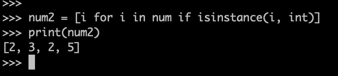

# python(弱类型语言)

## 一. 历史

> 1. 1989年  荷兰人  解释性语言
>
> 2. 解释性语言：shell  , python
>
> 3. python又成为“胶水语言”
> 4. 集成化比c语言还好
> 5. 时间的消耗比较大，运行的速度比较慢（有限的时间内c比python更快）
> 6. c语言和python集合是最快的
> 7. python的版本 ---3 个版本 （1.0  ， `2.x`，`3.x`）主要讲`python3`版本

## 二.应用领域

> web开发
>
> `google浏览器`
>
> 大数据处理
>
> 人工智能（数据集）
>
> 运维（自动化运维）
>
> 云计算
>
> 爬虫
>
> 游戏开发

## 三.安装python

`linux`当中有

## 四.python（动态类型的语言）

```python
print ("hello")
```

### 4.1语法规则

#### 4.1.1注释

```python
单行注释：#
多行注释  '''    '''      """      """


#!/usr/bin/env python
# coding=utf-8  中文解释

print("hello")  # 这是我的第一个python程序（单行注释）

''' 
多行注释
'''
"""多行注释"""


#缩进问题
sum = 0
for i in range(0, 101):
    sum +=  i
print (sum)

```

####  4.1.2命名规范

```python
#起名字的时候不要用模块的名字去命名
#这样的时候系统模块有一个python 自己创建一个python这样就会发生冲突
```

#### 4.1.3 保留字与标识符

```python
1. 保留字 ===> 关键字  使用一些被赋予特定定义的字符
	 import keyword
	keyword.kwlist

    不能命名
    【保留字   ['False', 'None', 'True', 'and', 'as', 'assert', 'async', 'await', 'break', 'class', 'continue', 'def', 'del', 'elif', 'else', 'except', 'finally', 'for', 'from', 'global', 'if', 'import', 'in', 'is', 'lambda', 'nonlocal', 'not', 'or', 'pass', 'raise', 'return', 'try', 'while', 'with', 'yield' 'print']
】

1.1当不小心用了保留字会报什么错误
	SyntaxError: invalid syntax  （语法错误：语法无效）
2.标识符：a  = 13
 	（1）不能用python中的保留字
    （2）有字母，下划线，数字等组成
    （3）区分大小写
    （4）避免以下划线开头
    
    __add表示类的私有成员
```

#### 4.1.4变量

* 变量的'定义'与使用

  

```python
#类型是可变的
>>> a =123
>>> print (a)
123
>>> type(a)
<class 'int'>
>>> a = "hello world"
>>> type(a)
<class 'str'>
>>> 


#id()    地址
#每一个常量对应一个地址
>>> a = 123
>>> id(123)
9306048
>>> id(a)
9306048
>>> a = "hello wprld"
>>> id("hello world")
140715297270448
>>> id(a)
140715296551408
>>> 
```

标识符：

- 1.字母下划线和数字，数字不能开头
- 2.不能用Python中的保留字
- 3.区分大小写
- 4.以下划线开头的一般都有特殊含义 例：`_ _ add 类的私有成员，_ _ init ()_ _ 构造函数`

## python 数据类型

+ 整型

+ 字符串 用来表示字符串

   

```
字符串里用‘’单引号，如上图。不能在单引号里用单引号会混乱，可双引号单引号三引号混合使用
换行 ：三引号
输出双引号：用转义字符
加 r R 就是转义字符不再转义，直接以双引号中所有字符按照原字符样子输出
```

+ 布尔 True False
+ 数据类型转换(强转) int(x) str(x)  chr(x) ord(x):将x 转换为十进制型`ord('a'97) ord('A')65`  (python 浮点类型只有float 无double )
+ 运算符 算数运算符 赋值运算符 比较运算符 位运算

```
/  正常除(精确)
// 整除
*  乘
x**y x的y次幂2**3 = 8
赋值运算符
=
+= 
-=
/=
%=  
//=  
**=  幂等于
比较运算符：True/False
>
<
==
!=
>=
<= (在python中可直接写成 60 <= a <= 80)
逻辑运算符
and(与)
or(或) 
not(非)
位运算 重要
& 按位与
| 按位或
~ 按位取反
^ 异或
<< 左移
>> 右移  运算符优先级 **最高
```

+ print 输出在文件里，格式控制

 __print 里加 end = "" 可以避免换行__ 

## 选择结构

选择语句 if  表达式 : 

## 循环结构

```python
sum = 0
i = 1
while i <= 100 :
    sum += i
    i += 1
print(sum)
```

range (start, and, step) [start, end)

```python
for i in range(0, 101, 2) :
    print (i)
#for i in range(101)代表0到100

string="hello world"
for i in string:
    print (i)
```

```python
pass站位无意义
a = 5
if a % 2 == 0 :
    print ("a is even")
else :
    pass
```

__break continue__


## 序列

1.通过索引去表示  索引<->下表=标

2.索引可以为负数，倒数第几位    arr[-2] -2：从后向前第二个元素

3.切片：（其实就是截取）访问一定范围范围内的元素

​	`listname[start：end： step]`取值方法是左闭右开法

4.序列加法：

将两种相同类型的序列进行相加（元素类型可以不同），但是不做去重的事情

5.序列乘法：

`list1 * 3   ==> list1`复制3次==>生成了一个新的序列

6.`in `判断值是不是当前序列的成员      (value   in  list)   在就是true  否则就是false

7.`len()函数`：当前序列的函数

8.`min()函数`：返回列表中最小元素              `max()函数`：返回列表中最大元素

9.`dict()`： 强转为字典  `   tuple()`：强转为元组   enumerate():将当前序列组合成带索引的序列


+ 索引 <=> 下标   可arr[-1] (从后向前的索引，arr[-1]代表的就是最后一个元素)
+ 切片 listname [start : end : step]  listname 序列名称 start 切片开始位置(包括当前位置，不写默认值为0)  end 切片结束位置(不包括) 取值范围 start ~ end - 1，step 切片步长 默认为1
+ 序列的加法 ：两种相同类型序列相加

`value in list`

 `sum() str() sorted() dirc() enumarate()将序列组合成为一个带索引的序列 tuple()元组 set()集合  `

## 列表 

### 1.创建列表：1）直接赋值运算  `listname = [element1, element2, ...]`

```python
>>> num = [1,   3 , 5]
>>> type(num)
<class 'list'>
>>> print(num)
[1, 3, 5]

```

2)创建空列表    `list1 = []`

3)创建赋值列表

```python
>>> list2 = list(range(10, 20, 2))
>>> print(list2)
[10, 12, 14, 16, 18]

```

### 2.销毁列表`（del）`

```python
>>> del list2
>>> type(list2)
Traceback (most recent call last):
  File "<stdin>", line 1, in <module>
NameError: name 'list2' is not defined

```

### 3.清空列表（clear）

```python
num = [1, 3,   5]
num.clear()
```

### 4.打印(访问)列表元素

```python
>>> num1 = [1, 2, 3, 4, 5]
>>> print(num1)
[1, 2, 3, 4, 5]
>>> num[0]
1
>>> num[-1]
5
>>> num[1:5]
[3, 5]

```

### 5.如何遍历列表的每一位

```
>>> for i in num:
...     print(i)
... 
1
3
5
>>>

>>> for index ,  item  in enumerate(num):
...     print(index, item)
... 
0 1
1 3
2 5
```

### 6.末尾追加元素  内置方法 append()

```python
listname.append(obj)
>>> num.append("不要脸")
>>> print(num)
[1, 3, 5, '不要脸']
```

### 7.两个列表的合并  extend()

```python
>>> list3 = ["帅", "能力强"]
>>> num.extend(list3)
>>> print(num)
[1, 3, 5, '不要脸', '帅', '能力强']

```

### 8.修改元素

```python
>>> num[0] = [3]
>>> print(num)
[[3], 3, 5, '不要脸', '帅', '能力强']
```

### 9.删除操作

#### 1）根据索引进行删除

```python
>>> del num[0]
>>> print(num)
[3, 5, '不要脸', '帅', '能力强']
>>> 

```

#### 2）内置方法  remove(value)

```python
>>> num.remove(5)
>>> print(num)
[3, '不要脸', '帅', '能力强']
如果value值不存在的话  就是报错
删除之前想做判断（删除第一个）
重复元素的话一次只能删除掉一个值
```

__列表允许重复出现__

- 列表创建 `list = []` `list2 = list(range(10, 20, 2))`
- 删除列表
- 访问列表元素：可通过列表索引访问列表元素


+ 遍历列表 `for item in num(链表名) 输出当前链表每一位，不能同时输出 表的索引和元素 `

  ```python
  可用 enumerate()listname  
  for index, item in enumerate()num
  	print(index, item)
  ```

+ 添加元素 append(obj) eg listname.append() 向列表listname末尾去添加元素 

+ 扩容 extend() listname.extend(list1) 将扩充list1 的内容扩容到listname

+ 修改元素 num[0] = '1'

+ 删除 del list[index] eg del num[3] 

+ list.remove(value) 重时只能删除一个 并且是第一个value

+ num.count(5) 查询值为5元素个数

+ 对列表进行统计与计算 count() 获取元素首次出现的下标

+ index()  listname.index(val) 找到某个值的下标

+ 队列表进行计算 sum()函数 sum(list) eg list为0~100 sum (1,  ) sum ()

+ 列表排序 

  + 使用列表对象sort()方法 listname.sort(key = None, reverse = False) key相当于一个排序方法 reverse 为False为正常的升序排列。sort方法是在原函数进行的
  + 内置函数 sorted(listname, key, reverse) 副本进行原函数不变
  + 

+ 列表推倒式  (快速的创建一个列表) `list = [expression  for  in range]`随机生成一个值



```
>>> import random  引用随机数种子的包 
>>> randnum = [random.randint(10, 100) for i in range(10)]
>>> randnum
[23, 44, 31, 23, 51, 49, 42, 89, 99, 72]
>>> 


>>> randnum = [random.randint(10, 100) for i in range(10)]
>>> randnum
[54, 60, 43, 22, 61, 81, 12, 47, 16, 46]
>>> 

>>> num1
[1, 2, 3, 4, 5]
>>> num2 = [ i for i in num1 if isinstance(i, int)] 
>>> num1
[1, 2, 3, 4, 5]
>>> 
```

当想在一个列表中提取出特别的类型时，在num中取出数字 `i for i in num if isinstance(i, int)` 


## 元组

+ 元组的创建 p=() 创建元素为1的元组 p = (1, )  `temp = tuple(range(0, 100, 3))`
+ 删除操作 清空 ，创建空元组p = () 
+ 元组是不可被修改的
+ 可合并   p + q         p += q
+ 元组推倒式 


## 列表 元组不同

> 元组对数据查询的速度比列表快
>
> 列表

## 字典

+ 键(key)值(value)对  `key1:value1, key2:value2`  键与值用冒号隔开，键值对之间用逗号隔开
+ 创建字典 dictionary = {"" : ""} 创建空字典 `dictionary = {}`   dict()通过映射函数创建字典  ，dictionary = dict(zip(list1, list2)) zip 作用：将list1 list2连个列表进行位置上元素进行对应一个为键一个为值，合成一个字典


+ 删除字典 clear()
+ 访问字典   访问键不存在会报错(key error)  对象方法dictionary.get(key, default) eg dictionary.get(3, "no")`
+ 增加元素 直接添加`dictionary[5] = "zhy"` __键唯一的__


+ dictionary.fromkeys 创建一个有key为none 的空字典    

  ```
  list = [0,1,2 ,3 ,4, 5, 6, 7]
  dictionaryy = dict.fromkeys(list) 结果为 dictionary字典中 {0:None,1:None,2:None,3:None,4:None,5:None,6:None,7:None}
  ```

  

dictionary.values() dictionary.keys()


```
p = (0, ) * 10
```

```
>>> x = ['A', 'B', 'C', 'D']
>>> y = ['a', 'b', 'b', 'd']
>>> dic = {i:j for i,j in zip(x,y)} 
>>> dic
{'A': 'a', 'B': 'b', 'C': 'b', 'D': 'd'}
```

## 集合

__去重, 乱序__

+ 创建 setname = set(iteration)
+ setname.add(element)

不能添加列表字典 element 

+ clear
+ 交集(&)  并集(|)  补集(-)

> 1.用花括号{}去表示
>
> 2.自动去重

> 集合（set）是一个无序的不重复元素序列。
>
> 可以使用大括号 **{ }** 或者 **set()** 函数创建集合，注意：创建一个空集合必须用 **set()** 而不是 **{ }**，因为 **{ }** 是用来创建一个空字典。
>
> ```python
> parame = {value01,value02,...}
> 或者
> set(value)
> ```

> 实例
>
> ```python
> >>>basket = {'apple', 'orange', 'apple', 'pear', 'orange', 'banana'}
> >>> print(basket)                      # 这里演示的是去重功能
> {'orange', 'banana', 'pear', 'apple'}
> >>> 'orange' in basket                 # 快速判断元素是否在集合内
> True
> >>> 'crabgrass' in basket
> False
>  
> >>> # 下面展示两个集合间的运算.
> ...
> >>> a = set('abracadabra')
> >>> b = set('alacazam')
> >>> a                                  
> {'a', 'r', 'b', 'c', 'd'}
> >>> a - b                              # 集合a中包含而集合b中不包含的元素
> {'r', 'd', 'b'}
> >>> a | b                              # 集合a或b中包含的所有元素
> {'a', 'c', 'r', 'd', 'b', 'm', 'z', 'l'}
> >>> a & b                              # 集合a和b中都包含了的元素
> {'a', 'c'}
> >>> a ^ b                              # 不同时包含于a和b的元素
> {'r', 'd', 'b', 'm', 'z', 'l'}
> ```
>
> ### 1.推导式:
>
> ```python
> >>>a = {x for x in 'abracadabra' if x not in 'abc'} 
> >>>a {'r', 'd'}
> ```
>
> ### 2.添加元素
>
> **语法格式如下：**
>
> ```python
> s.add(element) element 只能是不可变元素例字符串数字布尔 元组
> ```
> 

> 还有一个方法，也可以添加元素，且参数可以是列表，元组，字典等
>
> **语法格式如下：**
>
> ```
> s.update( x )
> ```
>
> x 可以有多个，用逗号分开。
>
> ```python
> >>>thisset = set(("Google", "Runoob", "Taobao"))
> >>> thisset.update({1,3}) >>> print(thisset) {1, 3, 'Google', 'Taobao', 'Runoob'}
> >>> thisset.update([1,4],[5,6])  
> >>> print(thisset) {1, 3, 4, 5, 6, 'Google', 'Taobao', 'Runoob'} 
> >>>
> ```
>
> ### 3、移除元素
>
> **语法格式如下：**
>
> ```
> s.remove( x )
> ```
>
> 将元素 x 从集合 s 中移除，如果元素不存在，则会发生错误。
>
> ```python
> >>>thisset = set(("Google", "Runoob", "Taobao"))
> >>> thisset.remove("Taobao") >>> print(thisset) {'Google', 'Runoob'} >>> thisset.remove("Facebook")  
> # 不存在会发生错误 Traceback (most recent call last):  File "<stdin>", line 1, in <module> KeyError: 'Facebook' >>>
> 
> 
> ```
>
> 此外还有一个方法也是移除集合中的元素，且如果元素不存在，不会发生错误。格式如下所示：
>
> ```python
> s.discard( x )
> ```
>
> ```python
> 
> >>>thisset = set(("Google", "Runoob", "Taobao"))
> >>> thisset.discard("Facebook") 
> # 不存在不会发生错误 >>> print(thisset) {'Taobao', 'Google', 'Runoob'}
> ```
>
> 我们也可以设置随机删除集合中的一个元素，语法格式如下：
>
> ```
> s.pop() 
> ```
>
> ```python
> thisset = set(("Google", "Runoob", "Taobao", "Facebook")) x = thisset.pop()  print(x)
> ```
>
> 输出结果：
>
> ```python
>  python3 test.py 
> Runoob
> ```
>
> 多次执行测试结果都不一样。
>
> set 集合的 pop 方法会对集合进行无序的排列，然后将这个无序排列集合的左面第一个元素进行删除
>
> ### 4、计算集合元素个数
>
> **语法格式如下：**
>
> ```
> len(s)
> 
> ```
>
> 计算集合 s 元素个数。
>
> ```python
> >>>thisset = set(("Google", "Runoob", "Taobao"))
> >>> len(thisset) 3
> ```
>
> 
>
> ### 5、清空集合
>
> **语法格式如下：**
>
> ```python
> s.clear()
> ```
>
> 清空集合 s。
>
> ## 实例(Python 3.0+)
>
> ```python
> >>>thisset = set(("Google", "Runoob", "Taobao")
> >>> thisset.clear() 
> >>> print(thisset) set()
> ```
>
> 
>
> ### 6、判断元素是否在集合中存在
>
> **语法格式如下：**
>
> ```
> x in s
> 
> ```
>
> 判断元素 x 是否在集合 s 中，存在返回 True，不存在返回 False。
>
> 
>
> ```python
> >>>thisset = set(("Google", "Runoob", "Taobao"))
> >>> "Runoob" in thisset True 
> >>> "Facebook" in thisset False >>>
> ```

## 总结

|            | 列表 | 元组 | 字典 | 集合 |
| ---------- | ---- | ---- | ---- | ---- |
| 是否可变   | 是   | 否   | 是   | 是   |
| 是否可重复 | 是   | 是   | 否   | 否   |
| 是否有序   | 是   | 是   | 否   | 否   |


### 内置函数

#### 集合内置方法完整列表

| 方法                                                         | 描述                                                         |
| :----------------------------------------------------------- | :----------------------------------------------------------- |
| [add()](https://www.runoob.com/python3/ref-set-add.html)     | 为集合添加元素                                               |
| [clear()](https://www.runoob.com/python3/ref-set-clear.html) | 移除集合中的所有元素                                         |
| [copy()](https://www.runoob.com/python3/ref-set-copy.html)   | 拷贝一个集合                                                 |
| [difference()](https://www.runoob.com/python3/ref-set-difference.html) | 返回多个集合的差集                                           |
| [difference_update()](https://www.runoob.com/python3/ref-set-difference_update.html) | 移除集合中的元素，该元素在指定的集合也存在。                 |
| [discard()](https://www.runoob.com/python3/ref-set-discard.html) | 删除集合中指定的元素                                         |
| [intersection()](https://www.runoob.com/python3/ref-set-intersection.html) | 返回集合的交集                                               |
| [intersection_update()](https://www.runoob.com/python3/ref-set-intersection_update.html) | 返回集合的交集。                                             |
| [isdisjoint()](https://www.runoob.com/python3/ref-set-isdisjoint.html) | 判断两个集合是否包含相同的元素，如果没有返回 True，否则返回 False。 |
| [issubset()](https://www.runoob.com/python3/ref-set-issubset.html) | 判断指定集合是否为该方法参数集合的子集。                     |
| [issuperset()](https://www.runoob.com/python3/ref-set-issuperset.html) | 判断该方法的参数集合是否为指定集合的子集                     |
| [pop()](https://www.runoob.com/python3/ref-set-pop.html)     | 随机移除元素                                                 |
| [remove()](https://www.runoob.com/python3/ref-set-remove.html) | 移除指定元素                                                 |
| [symmetric_difference()](https://www.runoob.com/python3/ref-set-symmetric_difference.html) | 返回两个集合中不重复的元素集合。                             |
| [symmetric_difference_update()](https://www.runoob.com/python3/ref-set-symmetric_difference_update.html) | 移除当前集合中在另外一个指定集合相同的元素，并将另外一个指定集合中不同的元素插入到当前集合中。 |
| [union()](https://www.runoob.com/python3/ref-set-union.html) | 返回两个集合的并集                                           |
| [update()](https://www.runoob.com/python3/ref-set-update.html) | 给集合添加元素                                               |

## 字符串

+ string.split(sep, maxsplit) 参数如果是sep代表的是以空格分割，不谢参数默认为None 代表以空字符分割，空字符包括(空格, 换行, \t) 第二个参数代表的是分割次数，不写默认全部分割。最后生成一个字符串列表，生成一个副本不会改变原字符串
+ ‘以该符号合并’.join(iterate)

```
string = ['我','的','名','字']
p = '@'.join(string) => '我@的@名@字'
```

+  str.count(sub[start, end]) start, end 为可选参数默认从头找到尾。在str中找sub出现了几次

+ str.find()方法 当前字符串是否包含sub  

+ str.startwith() str.endwith

+ str.upper() str.lower()  转化为大小写 如果待转变字符串已经是大小写了，(不用转变) 不会有变化，也不会抛出异常

+ strip() 方法用于移除字符串头尾指定的字符（默认为空格或换行符）或字符序列。只要头尾字符串头尾中有删除序列就伸出

  **注意：**该方法只能删除开头或是结尾的字符，不能删除中间部分的字符。

  

格式化字符串 template = '编号'

```
>>> template = '编号 : %09d\t公司名称 : %s\t官网 : www.%s.com'
>>> con1 = (7, '海贼科技', 'haizeix')
>>> print(template%con1)
编号 : 000000007	公司名称 : 海贼科技	官网 : www.haizeix.com

str.format(args )
```

+ str.encode(encoding='UTF-8',errors='strict') (strict ignoe replace不能转码的会有三个strict会抛异常，ignore忽略不会抛异常 replace替换为默认)将字符对象转化成二进制数据    
+ str.decode(encoding='UTF-8',errors='strict')  将二进制转化为字符对象  同上 

```
>>> string = "今天你努力了吗"
>>> string
'今天你努力了吗'
>>> bit = string.encode()
>>> bit
b'\xe4\xbb\x8a\xe5\xa4\xa9\xe4\xbd\xa0\xe5\x8a\xaa\xe5\x8a\x9b\xe4\xba\x86\xe5\x90\x97'
>>> bit.decode()
'今天你努力了吗'
```

## 正则表达式

行定位符 -> 字符串边界

元字符

^ : 行开始符号  eg ^tm : 以tm开始的字符串

$ :  匹配行尾    eg ^tm : 以tm结尾的字符串

.   : 匹配除换行符外，任意字符

\w : 匹配字母，数字，下划线，汉字

\W : 匹配除/w以外的 

\s 匹配单个字符(空白符 例 缩进空格)

\S 除单个字符外的字符

\b 匹配单词的开始或结束 `\bm\b 相当于找是否有 m 这个单词`

限定符

\w* 任意数量的字符或字母

\w?  匹配前面字符0次或1次

\w+ 匹配前面字符1次或多次

\w* 匹配前面字符0次或多次 

`?  重复匹配前面字符1次或0次`

`.  重复匹配前面字符1次或0次`

`+ 重复匹配前面字符1次或0次`

{n}        n次

{n, }      至少n次

{n, m}   n到m次 

__排除字符__

[^\n] 除了^后面字符(\n)之外全都匹配

__选择字符__

| 或

__转义字符__

\ 将特殊字符变成普通字符

__分组()__

Unicode编码表示汉字  [\u4e00 - \u9fa5] 连续多个汉字用  [\u4e00 - \u9fa5]+表示


__身份证 15 18__`(^\d[15]$)  (^\d[18]$) (^\d[17])`

转义字符 (`\`)

分组  \bm\w*\b

+ 
+ 下表范围 span group
+ find_all 

```
flags : 可选，表示匹配模式，比如忽略大小写，多行模式等，具体参数为：

re.I 忽略大小写
re.L 表示特殊字符集 \w, \W, \b, \B, \s, \S 依赖于当前环境
re.M 多行模式
re.S 即为 . 并且包括换行符在内的任意字符（. 不包括换行符）
re.U 表示特殊字符集 \w, \W, \b, \B, \d, \D, \s, \S 依赖于 Unicode 字符属性数据库
re.X 为了增加可读性，忽略空格和 # 后面的注释
```

+ re.sub(pattern, repl, string, count, flag) count模式匹配后替换次数 flag 匹配模式

+ 中文 `\u4e00-\u9fa5`u开头就代表了是unicode编码 .可用Encoding.Unicode.GetString(Encoding.Unicode.GetBytes("u4e00-u9fa5")) . 查看.

+ ### re.split

  split 方法按照能够匹配的子串将字符串分割后返回列表，它的使用形式如下：

  ```
  re.split(pattern, string[, maxsplit=0, flags=0])
  ```

  参数：

  | 参数     | 描述                                                         |
  | -------- | ------------------------------------------------------------ |
  | pattern  | 匹配的正则表达式                                             |
  | string   | 要匹配的字符串。                                             |
  | maxsplit | 分隔次数，maxsplit=1 分隔一次，默认为 0，不限制次数。        |
  | flags    | 标志位，用于控制正则表达式的匹配方式，如：是否区分大小写，多行匹配等等。参见：[正则表达式修饰符 - 可选标志](https://www.runoob.com/python/python-reg-expressions.html#flags) |

+ Python 的 re 模块提供了re.sub用于替换字符串中的匹配项。

  语法：

  ```
  re.sub(pattern, repl, string, count=0, flags=0)
  ```

  参数：

  - pattern : 正则中的模式字符串。
  - repl : 替换的字符串，也可为一个函数。
  - string : 要被查找替换的原始字符串。
  - count : 模式匹配后替换的最大次数，默认 0 表示替换所有的匹配。

+ ## re.match函数

  re.match 尝试从字符串的起始位置匹配一个模式，如果不是起始位置匹配成功的话，match()就返回none。

  **函数语法**：

  ```
  re.match(pattern, string, flags=0)
  ```

  函数参数说明：

  | 参数    | 描述                                                         |
  | ------- | ------------------------------------------------------------ |
  | pattern | 匹配的正则表达式                                             |
  | string  | 要匹配的字符串。                                             |
  | flags   | 标志位，用于控制正则表达式的匹配方式，如：是否区分大小写，多行匹配等等。参见：[正则表达式修饰符 - 可选标志](https://www.runoob.com/python/python-reg-expressions.html#flags) |

  匹配成功re.match方法返回一个匹配的对象，否则返回None。

  我们可以使用group(num) 或 groups() 匹配对象函数来获取匹配表达式。

  | 匹配对象方法 | 描述                                                         |
  | ------------ | ------------------------------------------------------------ |
  | group(num=0) | 匹配的整个表达式的字符串，group() 可以一次输入多个组号，在这种情况下它将返回一个包含那些组所对应值的元组。 |
  | groups()     | 返回一个包含所有小组字符串的元组，从 1 到 所含的小组号。     |

  ```
  #!/usr/bin/python # -- coding: UTF-8 --    
  import re 
  print(re.match('www', 'www.runoob.com').span())  # 在起始位置匹配 
  print(re.match('com', 'www.runoob.com'))         # 不在起始位置匹配
  输出 ：
  (0, 3)
  None
  ```
  __如果让匹配后结果等于result，可用print(result.start()) print(result.end()) 来查看匹配到的其实位置和结束位置__

+ ## re.search方法

  re.search 扫描整个字符串并返回第一个成功的匹配。

  函数语法：

  ```
  re.search(pattern, string, flags=0)
  ```

  函数参数说明：

  | 参数    | 描述                                                         |
  | ------- | ------------------------------------------------------------ |
  | pattern | 匹配的正则表达式                                             |
  | string  | 要匹配的字符串。                                             |
  | flags   | 标志位，用于控制正则表达式的匹配方式，如：是否区分大小写，多行匹配等等。 |

  匹配成功re.search方法返回一个匹配的对象，否则返回None。

  我们可以使用group(num) 或 groups() 匹配对象函数来获取匹配表达式。

  | 匹配对象方法 | 描述                                                         |
  | ------------ | ------------------------------------------------------------ |
  | group(num=0) | 匹配的整个表达式的字符串，group() 可以一次输入多个组号，在这种情况下它将返回一个包含那些组所对应值的元组。 |
  | groups()     | 返回一个包含所有小组字符串的元组，从 1 到 所含的小组号。     |

  ```
  #!/usr/bin/python # -- coding: UTF-8 --    import re print(re.search('www', 'www.runoob.com').span())  # 在起始位置匹配 print(re.search('com', 'www.runoob.com').span())         # 不在起始位置匹配
  输出:
  (0, 3)
  (11, 14)
  ```

  __re.match与re.search的区别 ：re.match只匹配字符串的开始，如果字符串开始不符合正则表达式，则匹配失败，函数返回None；而re.search匹配整个字符串，直到找到一个匹配。__

  ## findall()方法

  搜索所有符合正则表达式的字符串，返回一个列表，失败返回一个空列表 

  用法同上

  无对象方法 因为是列表

  

## re.sub() 替换

 re.sub(pattern, rep(), str, count, flags)

## re.split() 切分

re.split(pattern, string, masplit, flags)

# 第六章: 函数

函数是组织好的，可重复使用的，用来实现单一，或相关联功能的代码段。

函数能提高应用的模块性，和代码的重复利用率。你已经知道Python提供了许多内建函数，比如print()。但你也可以自己创建函数，这被叫做用户自定义函数。

------

## 定义一个函数

你可以定义一个由自己想要功能的函数，以下是简单的规则：

- 函数代码块以 **def** 关键词开头，后接函数标识符名称和圆括号 **()**。
- 任何传入参数和自变量必须放在圆括号中间，圆括号之间可以用于定义参数。
- 函数的第一行语句可以选择性地使用文档字符串—用于存放函数说明。
- 函数内容以冒号起始，并且缩进。
- **return [表达式]** 结束函数，选择性地返回一个值给调用方。不带表达式的return相当于返回 None。

------

`可用函数名. _default_ 查看函数参数默认值`

### 语法

Python 定义函数使用 def 关键字，一般格式如下：

```python
def 函数名（参数列表）:
    函数体
```

默认情况下，参数值和参数名称是按函数声明中定义的顺序匹配起来的。

### 实例 

让我们使用函数来输出"Hello World！"：

\>>>def hello() :   print("Hello World!")     >>> hello() Hello World! >>>

更复杂点的应用，函数中带上参数变量:

## 实例(Python 3.0+)

```python
#!/usr/bin/python3  
# 计算面积函数
def area(width, height):    
    return width * height 
def print_welcome(name):   
    print("Welcome", name)  
    print_welcome("Runoob") w = 4 h = 5
    print("width =", w, " height =", h, " area =", area(w, h))


```

以上实例输出结果：

```python
Welcome Runoob
width = 4  height = 5  area = 20
```

------

## 函数调用

定义一个函数：给了函数一个名称，指定了函数里包含的参数，和代码块结构。

这个函数的基本结构完成以后，你可以通过另一个函数调用执行，也可以直接从 Python 命令提示符执行。

如下实例调用了`**printme()** `函数：

 

## 实例(Python 3.0+)

```python
#!/usr/bin/python3  
# 定义函数 def printme( str ):   
# 打印任何传入的字符串   
print (str)   return 
# 调用函数 
printme("我要调用用户自定义函数!") printme("再次调用同一函数")
```

以上实例输出结果：

```
我要调用用户自定义函数!
再次调用同一函数
```

------

## 可变参数

*parameter 例：将` *list`当做实参传进来

**parameter  任意多个类似于关键字的参数

## 参数传递

在 python 中，类型属于对象，变量是没有类型的：

```python
a=[1,2,3]

a="Runoob"
```

以上代码中，**[1,2,3]** 是 List 类型，**"Runoob"** 是 String 类型，而变量 a 是没有类型，她仅仅是一个对象的引用（一个指针），可以是指向 List 类型对象，也可以是指向 String 类型对象。

### 可更改(mutable)与不可更改(immutable)对象

在 python 中，strings, tuples, 和 numbers 是不可更改的对象，而 list,dict 等则是可以修改的对象。

- **不可变类型：**变量赋值 **a=5** 后再赋值 **a=10**，这里实际是新生成一个 int 值对象 10，再让 a 指向它，而 5 被丢弃，不是改变a的值，相当于新生成了a。
- **可变类型：**变量赋值 **la=[1,2,3,4]** 后再赋值 **la[2]=5** 则是将 list la 的第三个元素值更改，本身la没有动，只是其内部的一部分值被修改了。

python 函数的参数传递：

- **不可变类型：**类似 c++ 的值传递，如 整数、字符串、元组。如fun（a），传递的只是a的值，没有影响a对象本身。比如在 fun（a）内部修改 a 的值，只是修改另一个复制的对象，不会影响 a 本身。
- **可变类型：**类似 c++ 的引用传递，如 列表，字典。如 fun（la），则是将 la 真正的传过去，修改后fun外部的la也会受影响

python 中一切都是对象，严格意义我们不能说值传递还是引用传递，我们应该说传不可变对象和传可变对象。

### python 传不可变对象实例

## 实例(Python 3.0+)

```python
#!/usr/bin/python3  

def ChangeInt( a ):    

	a = 10
    b = 2 
    ChangeInt(b) 
    print( b ) # 结果是 2
```

实例中有 int 对象 2，指向它的变量是 b，在传递给 ChangeInt 函数时，按传值的方式复制了变量 b，a 和 b 都指向了同一个 Int 对象，在 a=10 时，则新生成一个 int 值对象 10，并让 a 指向它。

### 传可变对象实例

可变对象在函数里修改了参数，那么在调用这个函数的函数里，原始的参数也被改变了。例如：

## 实例(Python 3.0+)

```python
#!/usr/bin/python3  # 可写函数说明 
def changeme( mylist ):   "修改传入的列表"   
    mylist.append([1,2,3,4])   
    print ("函数内取值: ", mylist)   
    return  # 调用changeme函数 
mylist = [10,20,30] 
changeme( mylist ) print ("函数外取值: ", mylist)
```

传入函数的和在末尾添加新内容的对象用的是同一个引用。故输出结果如下：

```python
函数内取值:  [10, 20, 30, [1, 2, 3, 4]]
函数外取值:  [10, 20, 30, [1, 2, 3, 4]]
```

------

## 参数

以下是调用函数时可使用的正式参数类型：

- 必需参数
- 关键字参数
- 默认参数
- 不定长参数

### 必需参数

必需参数须以正确的顺序传入函数。调用时的数量必须和声明时的一样。

调用 printme() 函数，你必须传入一个参数，不然会出现语法错误：

## 实例(Python 3.0+)

```python
#!/usr/bin/python3  
#可写函数说明 
def printme( str ):   "打印任何传入的字符串"   
    print (str)   return  # 调用 printme 函数，不加参数会报错 printme()
```

以上实例输出结果：

```python
Traceback (most recent call last):
  File "test.py", line 10, in <module>
    printme()
TypeError: printme() missing 1 required positional argument: 'str'
```

### 关键字参数

关键字参数和函数调用关系紧密，函数调用使用关键字参数来确定传入的参数值。

使用关键字参数允许函数调用时参数的顺序与声明时不一致，因为 Python 解释器能够用参数名匹配参数值。

以下实例在函数 printme() 调用时使用参数名：

## 实例(Python 3.0+)

```python
#!/usr/bin/python3  #可写函数说明 
def printme( str ):   "打印任何传入的字符串"   
    print (str)   
    return  #调用printme函数 printme( str = "菜鸟教程")


```

以上实例输出结果：

```
菜鸟教程
```

以下实例中演示了函数参数的使用不需要使用指定顺序：

## 实例(Python 3.0+)

```python
#!/usr/bin/python3  #可写函数说明 
def printinfo( name, age ):   "打印任何传入的字符串"   
    print ("名字: ", name)   
    print ("年龄: ", age)  
    return  #调用printinfo函数 
printinfo( age=50, name="runoob" )


```

以上实例输出结果：

```
名字:  runoob
年龄:  50
```

### 默认参数

调用函数时，如果没有传递参数，则会使用默认参数。以下实例中如果没有传入 age 参数，则使用默认值：

## 实例(Python 3.0+)

```python
#!/usr/bin/python3  #可写函数说明 
def printinfo( name, age = 35 ):   "打印任何传入的字符串"   
    print ("名字: ", name)   
    print ("年龄: ", age)   
    return  #调用printinfo函数 
printinfo( age=50, name="runoob" ) 
print ("------------------------") 
printinfo( name="runoob" )
```

以上实例输出结果：

```
名字:  runoob
年龄:  50
------------------------
名字:  runoob
年龄:  35
```

### 不定长参数

你可能需要一个函数能处理比当初声明时更多的参数。这些参数叫做不定长参数，和上述 2 种参数不同，声明时不会命名。基本语法如下：

```python
def functionname([formal_args,] *var_args_tuple ):
   "函数_文档字符串"
   function_suite
   return [expression]
```

加了星号 ***** 的参数会以元组(tuple)的形式导入，存放所有未命名的变量参数。

## 实例(Python 3.0+)

```python
#!/usr/bin/python3   # 可写函数说明 
def printinfo( arg1, *vartuple ):   "打印任何传入的参数"  
    print ("输出: ")  
    print (arg1)  
    print (vartuple)  # 调用printinfo 函数 printinfo( 70, 60, 50 )
```

以上实例输出结果：

```
输出: 
70
(60, 50)
```


如果在函数调用时没有指定参数，它就是一个空元组。我们也可以不向函数传递未命名的变量。如下实例：


## 实例(Python 3.0+)

```python
#!/usr/bin/python3  # 可写函数说明 
def printinfo( arg1, *vartuple ):   "打印任何传入的参数"   
    print ("输出: ")   
    print (arg1)   
    for var in vartuple:      
        print (var)   
        return  # 调用printinfo 函数 printinfo( 10 ) printinfo( 70, 60, 50 )
```

以上实例输出结果：

```
输出:
10
输出:
70
60
50
```

还有一种就是参数带两个星号 ***\***基本语法如下：

```python
def functionname([formal_args,] **var_args_dict ):
   "函数_文档字符串"
   function_suite
   return [expression]
```

加了两个星号 ***\*** 的参数会以字典的形式导入。

## 实例(Python 3.0+)

```python
#!/usr/bin/python3   # 可写函数说明 
def printinfo( arg1, **vardict ):   "打印任何传入的参数"   
    print ("输出: ")   
    print (arg1)  
    print (vardict)  # 调用printinfo 函数 printinfo(1, a=2,b=3)

```

以上实例输出结果：

```
输出: 
1
{'a': 2, 'b': 3}
```

声明函数时，参数中星号 ***** 可以单独出现，例如:

```python
def f(a,b,*,c):
    return a+b+c
```

如果单独出现星号 ***** 后的参数必须用关键字传入。

```python
>>> def f(a,b,*,c):
...     return a+b+c
... 
>>> f(1,2,3)   # 报错
Traceback (most recent call last):
  File "<stdin>", line 1, in <module>
TypeError: f() takes 2 positional arguments but 3 were given
>>> f(1,2,c=3) # 正常
6
>>>
```

------

## 匿名函数

python 使用 lambda 来创建匿名函数。

所谓匿名，意即不再使用 def 语句这样标准的形式定义一个函数。

- lambda 只是一个表达式，函数体比 def 简单很多。
- lambda的主体是一个表达式，而不是一个代码块。仅仅能在lambda表达式中封装有限的逻辑进去。
- lambda 函数拥有自己的命名空间，且不能访问自己参数列表之外或全局命名空间里的参数。
- 虽然lambda函数看起来只能写一行，却不等同于C或C++的内联函数，后者的目的是调用小函数时不占用栈内存从而增加运行效率。
- `求圆的面积 lambda r : math.pi * r * r` 第一个r代表传进去的参数

```
print(”半径为“ + str(r) + "的圆的半径" + str(result))
print(”半径为“ , r, "的圆的半径", result)
```


### 语法

lambda 函数的语法只包含一个语句，如下：

```
lambda [arg1 [,arg2,.....argn]]:expression
```

如下实例：

## 实例(Python 3.0+)

```python
#!/usr/bin/python3  # 可写函数说明 
sum = lambda arg1, arg2: arg1 + arg2  # 调用sum函数 
print ("相加后的值为 : ", sum( 10, 20 )) 
print ("相加后的值为 : ", sum( 20, 20 ))


```

以上实例输出结果：

```
相加后的值为 :  30
相加后的值为 :  40
```

------

## return语句

**return [表达式]** 语句用于退出函数，选择性地向调用方返回一个表达式。不带参数值的return语句返回None。之前的例子都没有示范如何返回数值，以下实例演示了 return 语句的用法：

## 实例(Python 3.0+)

```python
#!/usr/bin/python3  # 可写函数说明 
def sum( arg1, arg2 ):   # 返回2个参数的和."   
    total = arg1 + arg2   
    print ("函数内 : ", total)   
    return total  # 调用sum函数 
total = sum( 10, 20 ) 
print ("函数外 : ", total)
```

以上实例输出结果：

```
函数内 :  30
函数外 :  30
```

------

## 强制位置参数

`Python3.8 `新增了一个函数形参语法 / 用来指明函数形参必须使用指定位置参数，不能使用关键字参数的形式。

在以下的例子中，形参 a 和 b 必须使用指定位置参数，c 或 d 可以是位置形参或关键字形参，而 e 或 f 要求为关键字形参:

```python
def f(a, b, /, c, d, *, e, f):
    print(a, b, c, d, e, f)
```

以下使用方法是正确的:

```python
f(10, 20, 30, d=40, e=50, f=60)
```

以下使用方法会发生错误:

```
f(10, b=20, c=30, d=40, e=50, f=60)   # b 不能使用关键字参数的形式
f(10, 20, 30, 40, 50, f=60)           # e 必须使用关键字参数的形式
```

## 面向对象

+ 静态部分
  + 属性
+ 动态部分
  + 对象的行为或方法

类 的命名规则是采用驼峰式命名 egClassName

对象

对象是类的实例化

__面向对象程序设计三大特点：封装， 继承，多态__

>  封装：核心思想，面向对象程序设计的思想打包生成类
>
> 继承：子类继承父类
>
> 多态："多种状态" eg 飞 有多种状态

 >`def __init__(self)`构造方法 默认参数self
 >
 >`def __init__(self   )`多个参数

> class  classname()

类成员：类的属性，类的方法，

数据成员 类属性

类方法的访问：类的实例的名字 例类name的一个实例对象为instance,就可写为 instance.function来访问类的function方法

类中定义 变量 ：在类内部在函数外部(类属性)，在类内部有在类函数内部的变量(实例属性)

类名特点 public  private protected

增加下划线 权限

`_ _name_ _`  特定方法 系统定义的 例 ` _ _init_ _()`

`_name` 单下划线开头的protected，受保护的，值允许本身和子类可以访问

`_ _name`private只允许定义该方法的类本身来访问,不可以通过类创建的实例去访问。

对于双下划线类型成员访问方式 : `类的实例名._ 类名 _ _`

## 文件操作

`fp = open(file, mode, encoding) file文件路径 modew文件读写模式 encoding 编码模式大多数utf-8`

fp = ope(file, mode, encoding) 

+ mode = r只读 

+ w 写入(文件如果不存在就新创建，否则就吧旧内容覆盖) 
+ a 追加写(从最后一行开始添加内容)
+ rb  二进制形式打开文件只用于读
+ wb 二进制形式打开文件用于写
+ ab  二进制形式打开文件用于追加
+ r+  打开用于读写
+ w+ 打开用于读写，存在就覆盖，不存在创建否则覆盖
+ a+  打开用于读写追加写


+ fp.close()
  + fp.flush()      		   将缓冲中的内容区立刻写到文件
  	 fp.next() 		   返回文件内容的下一行 
+  fp.read(size)                   读文件size读取指定字节数(可选参数) 负值时就是读取全部内容
+ fp.realine()                       读取一行的内容，包括”\n“
+ fp.readlines()                   读取所有行的内容
  + len = fp.write(str)     返回值代表每次写入字符串长度
+ fp.writelines(sequence) 向文件写入一系列字符串  自己加换行符
+ fp.seek(offset)                  设置当前文件 文件指针指向的位置

## 模块

os模块：处理文件和目录的

listdir() 方法 以列表类型获得当前目录下文件的名字

makedirs()方法 创建多级目录

exists()方法 传入路径 判断目录是否存在

__datetime 模块__

__random模块 ：生成随机数__

randint(start, end)

choice()参数是一个列表 例choice([1, 2, 3, 4])

__json模块：__

__csv 模块：使用Python语言 读写csv格式文件__

write()方法    写

reader()方法 读

## 爬虫

urllib模块

+ urllib.requests 发送requests请求获得结果
+ urllib.error  处理异常
+ urllib.parse 解析和处理url
+ urllib.robotparse  解析robots.txt文件的

2个插件

+ virtualenv
+ virtualenv wrapper

### requests

requests.get(url, params)  参数 url:连接，params 是否访问URL后面的某一个拼接字段(固定的)

requests.post(url, data = None, json = None) data参数传参

返回的内容都是本次请求的响应对象 

## 用爬虫爬取百度贴吧

+ 分析目标网站
+ 设计程序
+ 流程


+ 提取标题  信息和URL

+ 提取图片

  

+ 向起始URL发出请求

+ 从(1)中的响应中提取出每个贴吧标题和对应的URL，发送请求，获取响应（正则表达式）

+ 在(2)响应中 提取每张图的URL 发送请求

+ 保存图片

+ 从(1)中提取下一页URL

Spider

下载中间件

scrapy start project tutorial

