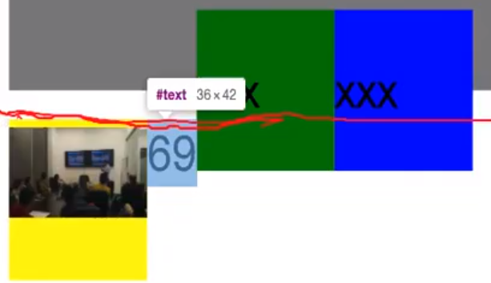

## css结构

元素选择器 


优先级 

选择器之间 会有叠加 层叠样式表,所有匹配上的选择器都会作用,下面定义的类选择器会覆盖掉上面类选择器定义的相同的属性,不同的不会,按照优先级,优先级别高的也会覆盖掉优先级别低的共有属性

元素选择器 1 类选择器10 id选择器100 行内选择器1000


## 属性列表

- background-color 颜色
- background-position

| 值                                                           | 描述                                                         |
| ------------------------------------------------------------ | ------------------------------------------------------------ |
| top lefttop centertop rightcenter leftcenter centercenter rightbottom leftbottom centerbottom right | 如果您仅规定了一个关键词，那么第二个值将是"center"。默认值：0% 0%。 |
| x% y%                                                        | 第一个值是水平位置，第二个值是垂直位置。左上角是 0% 0%。右下角是 100% 100%。如果您仅规定了一个值，另一个值将是 50%。 |
| xpos ypos                                                    | 第一个值是水平位置，第二个值是垂直位置。左上角是 0 0。单位是像素 (0px 0px) 或任何其他的 CSS 单位。如果您仅规定了一个值，另一个值将是50%。您可以混合使用 % 和 position 值。 |

- background-size 只设置一个就等比例缩放 ;例20px 宽度 10px 高度

- background-repeat  no-repeat不重复 repeat-x  x轴重复 repeat-y轴重复

- background-origin 

- ## 相关页面

- background-clip 

- 

- background-image 图片


+ width :只针对于块级元素有效 内联元素无效（行内元素 <a> <p>）
+ display :改变相关元素性质 

```
display: block;
/*block变为块元素/ inline-block不换行但是变为块元素可用size调整宽	 / inline彻底变成内敛元素,宽高失效*/
```

 变为块级元素后对width生效则就独占一行

inline-block 还是内联元素但是width生效

+ padding： padding-top: 20px 30px 40px 50px;

  ​            /*一个值就是上下左右都一个数,两个就是上下,左右,三个值就是上,左右,下,四个值就是上,右,下,左*/

  代表着上右下左 如果其中一个值没输入，那么默认为与其对应边的大小例 20px 30px 40px 上20右30下40 左没有对边为右=30px所以做也为30px。如果就一个值那么就默认上右下左都为一个值


+ border ：边框 `border:1px solid #000` 设计一个实线黑色边框 

  ​			 `border:1px dotted #000` 设计一个虚线黑色边框 

  + 分开写	 border-top: 30px solid red;

    ​                 border-right: 20px solid green; 

    ​                 border-bottom: 30px solid blue; 

    ​                 border-left: 40px solid transparent;

                __不要padding将并且内容大小设置为0__

​                               

transparent透明

+ mergin外边框

## 父级元素的嵌套大小

+ 块级元素在不设置父元素高度的情况下，父元素是由其子元素撑开的

__在这个情况下父元素内容宽度为100px而子元素宽度为104px所以发生了子元素溢出__


__解决办法 可用box-sizing : border/content -box border-box指得是当前设计的宽度为内容+内边距+边框高度之和，content -box指的就是内容宽度 __

也就是说可以用这个方法来防止由于计算错误出现的子元素移除问题


+ 块级元素在不设计外边距的情况下是与父元素内容宽度等长的(占满整个)
+ 行内块级元素不涉及宽度默认是被子元素撑起来的
   设置margin-left = 20px是距离外边距左边距离 向着反方向移动	margin-left = -20px，如果是负值就是向着这个方向运动
+ overflow :hidden 用于隐藏起超出该父元素范围内的子元素，预防上面提到的情况发生
+ 水平居中 margin: 0 auto ,设置上下边距为0 左右边距为auto ,浏览器因为左右边距相等，所以就会是整个浏览器页面的一半一半，就会达到居中的效果。

# 第四节 404页面制作

## float 布局

## float 布局基础

要想理解 **float** 浮动的本质，你只需要记住一句话：浮动就是把元素从**文档流**中放到了**浮动流**。

理解浮动效果，就要记住，子元素在父元素内部浮动，要搞清楚父元素的内容区域在哪里。

### float 属性的取值说明

[W3School 参考链接](https://www.w3school.com.cn/cssref/pr_class_float.asp)

| 编  号 | 取  值  | 说  明                                             |
| ------ | ------- | -------------------------------------------------- |
| 1      | left    | 元素向左浮动                                       |
| 2      | right   | 元素向右浮动                                       |
| 3      | none    | 默认值。元素不浮动，并会显示在其在文本中出现的位置 |
| 4      | inherit | 规定应该从父元素继承 float 属性的值                |

+ clear : 清除浮动 也可理解为clear:right ,就是设计该属性的元素不允许自己的右边有其他元素，如果当前行右边右哦元素就放下一行，右边无元素就放在当前行。clear:left 就是设计该属性的元素不允许自己的左边有其他元素，苏果当前行左边有元素就放下一行，否者就放在当前行
+ 如果clear 属性在一个没有哦浮动的元素上那么就相当于换行
+ 浮动对于元素有效如果想对一篇文章中的某个字设置浮动，就可以用span标签包裹该文字(也可用em, i, b等标签)，使之成为元素，在对span元素设置浮动。在文章中只要出现换行后左浮动的文字当前行是在浮动。
+ 小技巧 可将其放到父元素里 占父元素的半分之百，控制父元素大小即可

## 列表

`分为有序列表，无序列表，定义列表  `

+ ul 和 li 都是块级元素

+ ```
  二级标题制作过程 
  先设置一级标题，设置好后将其变成行内块级元素 使之成为一行 然后可以通过改变margin来改变每一项之间的距离，，然后用cursor：pointer，设置为鼠标碰见变小手，用伪选择器:hover设置鼠标碰到后变色。
  然后设计二级标题
  在一级标题中加入ul 和 li 就有了二级标题，将二级标题设置float属性	用list-style-typle:none去掉列表前的小点，在一级标签上设置hright 和line-height用来设置一级标签和二级标签之间的距离。设置二级标题的背景颜色以及字体颜色，在一级标签中设置。overflow:hidden(意为隐藏超过当前元素，即隐藏起二级标签)，在二级标题hover(鼠标触碰触发)中设置overflow:visible(意为鼠标移动到该元素时超出部分可见，即展现出二级标题)。在设置overflow时会改变对齐方式，所以元素在鼠标碰到的时候会下移一块，加上语句vertical-align:top;重新对齐即可
  ```

## 基线 vertical-align 属性

## 可能的值

| 值          | 描述                                                         |
| ----------- | ------------------------------------------------------------ |
| baseline    | 默认。元素放置在父元素的基线上。                             |
| sub         | 垂直对齐文本的下标。                                         |
| super       | 垂直对齐文本的上标                                           |
| top         | 把元素的顶端与行中最高元素的顶端对齐                         |
| text-top    | 把元素的顶端与父元素字体的顶端对齐                           |
| middle      | 把此元素放置在父元素的中部。                                 |
| bottom      | 把元素的顶端与行中最低的元素的顶端对齐。                     |
| text-bottom | 把元素的底端与父元素字体的底端对齐。                         |
| length      |                                                              |
| %           | 使用 "line-height" 属性的百分比值来排列此元素。允许使用负值。 |
| inherit     | 规定应该从父元素继承 vertical-align 属性的值。               |

+  sub 6666设置sub 属性 
+ super  将99999设置为super ,因为99999已经在顶端了，无法上移，所以只能基线向下移动，那向基线对齐的元素也都向下移动，也就变成了所有除了9之外的元素都跟着基线向下移动
+ text-bottom 是以父元素底部(即X)对齐  666666 和 abcdefghijk都设置了 text-bottom 属性 都与X对齐 所以恢复了最原始的样子 


+ top 让其顶边与当前最高元素顶边(包括上边距)对齐
+ 没设置vertical-align 属性的元素默认放在基线上
+ bottom 让底边与最低的对其，下图正常黄色应和绿色底部对齐，但是发生了如下的差距


因为有行高，此时黄块与当前行的低端进行了对齐，因为此时行的底部才是最底的位置所以黄块与行高对齐发生了偏差 

将行高设置为0就恢复正常了


+ text-top 元素订端与当前文本行最高的地方对齐 
+ text-bottom  当前元素顶端与当前文本行最底的位置对齐          

__text-bottom 和 bottom 是有区别的 text-bottom是与当前文本行最低处对齐 ，bottom是与当前行最低元素的底部对齐 __


### in line-block 基线

+ 默认状态


+ 可通过x 找到基线，当正方形中没有内容时，就是按照默认，如果有内容，那么就按照内容的最后一行底部对齐（紫色为背景颜色）
+ 当有内容并设置overflow为hidden是是以父元素最底部对齐的(包括边框)


+ 当有内容并没有设置overflow属性 和 overflow属性设置为visible时 是以内容最后一行的底部对齐的(基线位置) 


__总结 inline-block 元素 默认基线在元素底部有两种情况 1.无内容 2.overflow：hidden 基线在元素中内容最后一行有两种情况 1.有内容 无overflow 2.有内容并 overflow：visible__

+ middle 使元素与父元素中间对齐(黑框与父元素x中间对齐)


+ 实现一个元素水平数值方向都居中

  ```html
  可先设计两个元素，一个作为父元素 让子元素设置vertical-align:middle，即与父元素中间对齐(可通过xxx位置寻找)，在通过设置父元素的line-height等于最外层元素高度，是子元素数值方向上居中，在将父元素边框去掉并将宽度设置为0，就可以是父元素在最终界面上不显示，最后通过对父元素设置margin:0px auto,使父元素水平居中，这样子元素也就跟着父元素正在水平方向上了，在设置子元素margin-left属性对子元素进行一个调整，就可实现是子元素在最外层元素中水平和竖直方向上都居中的效果
  <!DOCTYPE html>
  <html lang="en">
  <head>
      <meta charset="UTF-8">
      <meta name="viewport" content="width=device-width, initial-scale=1.0">
      <meta http-equiv="X-UA-Compatible" content="ie=edge">
      <title>vertical-align</title>
      <style>
      .box {
          width: 600px;
          height: 600px;
          margin: 0 auto;
          border: 3px solid #abcdef; 
      }
      .father {
          margin: 0 auto;
          width: 0;
          height: 600px;
          line-height: 600px;
      }
      .son {
          display: inline-block;
          width: 100px;
          height: 60px;
          border: 5px solid red;
          vertical-align: middle;
          margin: -50px;
      }
      </style>
  </head>
  <body>
      <div class="box">
          <div class="father">
              <div class="son"></div>
          </div>
      </div>
  </body>
  </html>
  ```

  


## CSS布局

+ 正常流normanl flow
+ display 属性
+ 浮动Float
+ 定位 Positioning
+ 弹性盒子 Flexbox 自动缩放大小
+ 网格 Grid ()
+ 表格布局
+ 多栏布局
+ 响应式设计 REsponsive design

## CSS 值和单位

> 关键字 如 left auto none  

宽高等比

```


```

1. 来源和重要性 Origin and Importance

   1. transition 属性声明
   2. 以 !important 标记的用户代理样式声明
   3. 以 !important 标记的用户样式声明
   4. 以 !important 标记的作者样式声明
   5. animation 属性声明
   6. 普通作者样式声明
   7. 普通用户样式声明
   8. 普通用户代理样式声明

   该列表越靠前的来源和重要性胜出

2. 特指度/特殊性 Specificity

   选择器特指度计算规则如下

   - 计算 id 选择器的数量（=a）
   - 计算类选择器、属性选择器、伪类选择器的总数量（=b）
   - 计算元素选择器、伪元素选择器的总数量（=c）
   - 忽略通用选择器

   最终得出一个值 a-b-c，比较时候从 a 到 c 的顺序比较，a 相等情况下才比较 b，b 相等才比较 c

   通过 style 属性设置的样式具有最高的特指度

   特指度最高的声明胜出

3. 出现顺序

   位置靠后的声明胜出