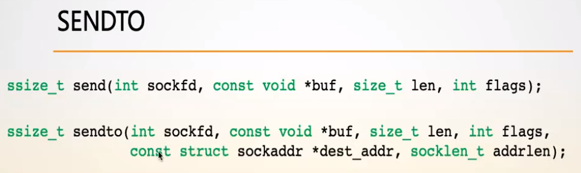
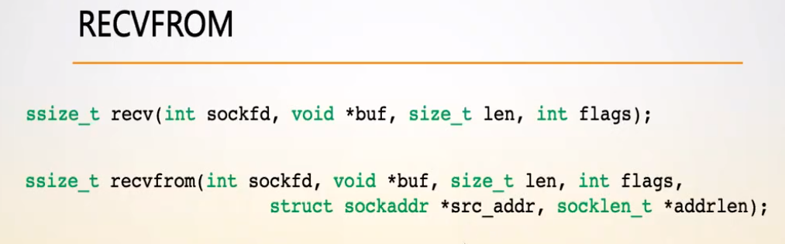
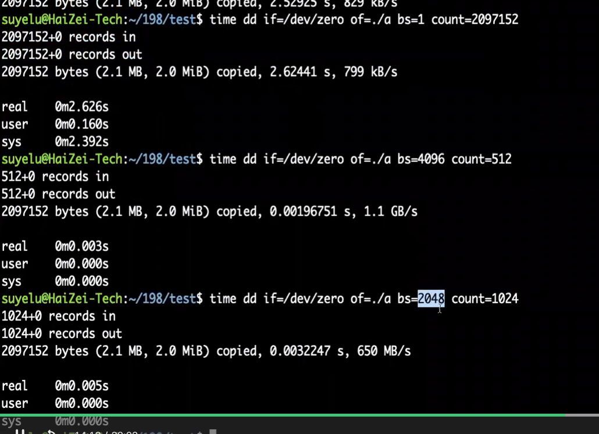
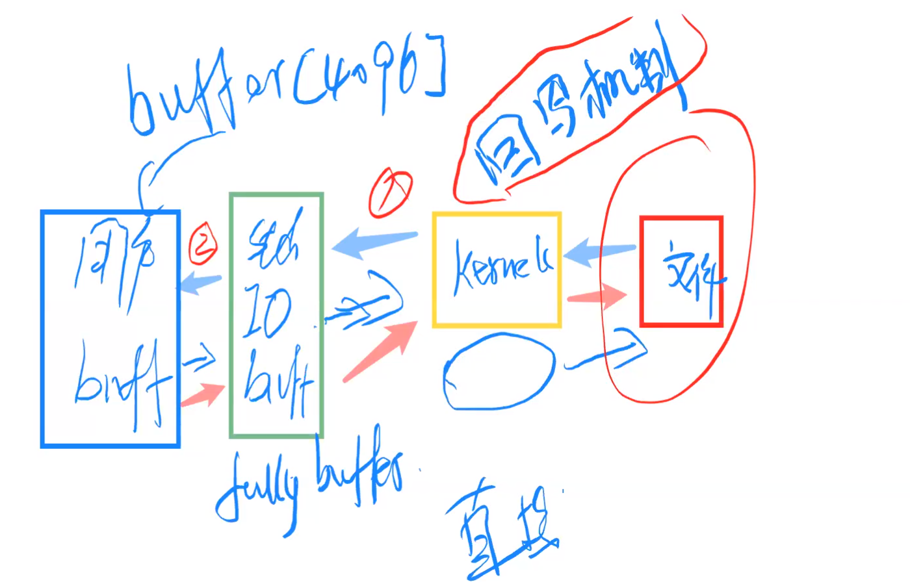
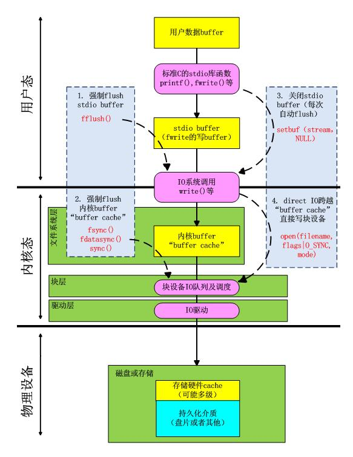
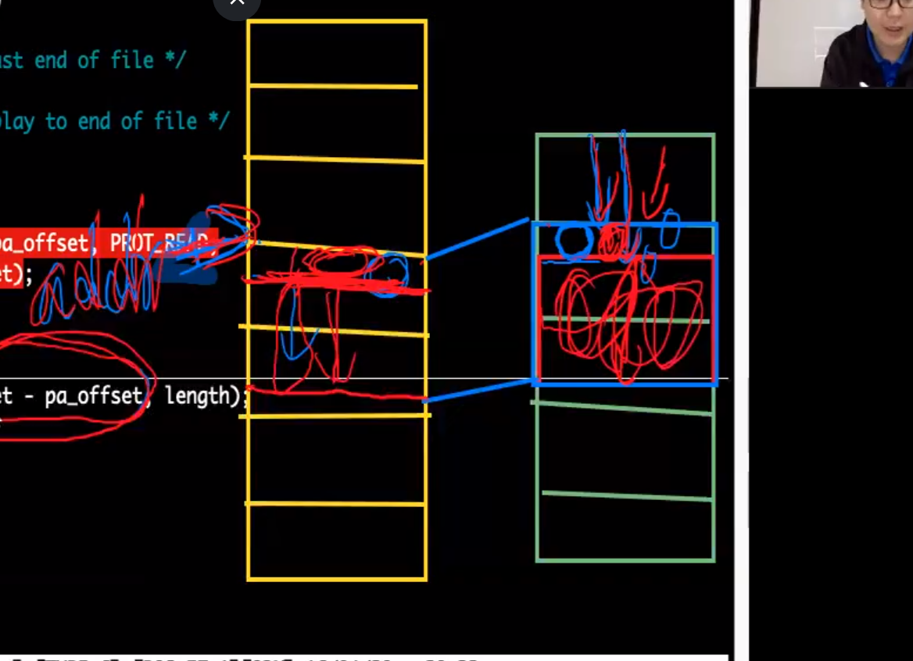

# socket编程

## SOCKET编程套接字

```
int socket(int domain, int type, int protocol);
				域          类型       协议
```

相当于一个门，端口

## bind绑定IP地址及端口

```
int bind (int sockfd, const struct sockaddr *addr, socketlen_t addrlen)
			 socked 返回的									地址长度
			 成功返回0 否则-1
```


INADDR_ANY意思是所有的IP地址传来的信息都要，相当于0.0.0.0

- struct sockaddr *addr 结构体


- 绑定IP地址代表只接收从该IP地址传来的信息
- 绑定套接字就是绑定门牌号

## 网络字节序与主机字节序


- 网络字节序是大段，本地字节序不确定
- **int atoi(const char \*str)** 把参数 **str** 所指向的字符串转换为一个整数（类型为 int 型）。

TCP 三次握手四次挥手

## listen()监听socket

```转化成
int listen (int sockfd, int backlog)把主动套接字转化成被动
                            连接队列数量
```

## accept()接受连接

```
int accept(int sockfd, struct sockaddr *addr, socklen_t *addrlen)
							对方地址信息           长度
```


## connect()创建连接

```
int connect(int sockfd, const struct sockaddr *addr, socklen_t addrlen)
主动连接        通过哪个窗口连          连接对方的地址          地址长度
```


## getpeername() 获取对端地址

```
int getpeername(int sockfd, struct sockaddr *addr, int *addrlen)
                               地址指针                   地址长度
```


## gethostname()获取本地机主名


## close()关闭连接

```
int close (int fd)
```

## send()发送数据

与write相似 ，冲缓冲区中写数据

```
int send(int sockfd, const void *mes, int len, int flags)
```


## recv() 接收数据

与read相似 从缓冲区中取数据s

```
int recv(int sockfd, void *buf, int len, unsigned int flags)
```


## 可供应用程序使用的运输服务

应用程序服务需要

- 可靠数据传输
- 吞吐量
- 定时
- 安全性

# UDP 





# 多进程

## 结构体

引用结构体成员时，有时用点运算符( . )，时而是用箭头运算符( -> )；两者之间的使用有什么区别？

相同点：两者都是二元操作符，而且右边的操作数都是成员的名称。
不同点：点运算符( . )的左边操作数是一个结果为结构的表达式；
              箭头运算符( -> )的左边的操作数是一个指向结构体的指针。

```
 1 typedef struct          // 定义一个结构体类型：DATA
 2 {
 3     char key[10];       // 结构体成员：key
 4     char name[20];      // 结构体成员：name
 5     int age;            // 结构体成员：age
 6 }DATA;
 7     
 8 DATA data;              // 声明一个结构体变量
 9 DATA *pdata;            // 声明一个指向结构体的指针
10     
11 // 访问数据操作如下：
12 data.age = 24;          // 结构体变量通过点运算符( . )访问
13 pdata->age = 24;        // 指向结构体的指针通过箭头运算符( -> )访问
```

如果一个函数的传入参数是结构体，且需要该结构体作为返回值的时候，必须采用指针传递的方式，其中对结构体赋值必须使用箭头运算符

# fork

```
一个进程，包括代码、数据和分配给进程的资源。fork（）函数通过系统调用创建一个与原来进程几乎完全相同的进程，也就是两个进程可以做完全相同的事，但如果初始参数或者传入的变量不同，两个进程也可以做不同的事。
 一个进程调用fork（）函数后，系统先给新的进程分配资源，例如存储数据和代码的空间。然后把原来的进程的所有值都复制到新的新进程中，只有少数值与原来的进程的值不同。相当于克隆了一个自己。
```

# 共享内存

**1、shmget()函数**

该函数用来创建共享内存，它的原型为：

> int shmget(key_t key, size_t size, int shmflg);

第一个参数，与信号量的semget函数一样，程序需要提供一个参数key（非0整数），它有效地为共享内存段命名，shmget()函数成功时返回一个与key相关的共享内存标识符（非负整数），用于后续的共享内存函数。调用失败返回-1.

不相关的进程可以通过该函数的返回值访问同一共享内存，它代表程序可能要使用的某个资源，程序对所有共享内存的访问都是间接的，程序先通过调用shmget()函数并提供一个键，再由系统生成一个相应的共享内存标识符（shmget()函数的返回值），只有shmget()函数才直接使用信号量键，所有其他的信号量函数使用由semget函数返回的信号量标识符。

第二个参数，size以字节为单位指定需要共享的内存容量

第三个参数，shmflg是权限标志，它的作用与open函数的mode参数一样，如果要想在key标识的共享内存不存在时，创建它的话，可以与IPC_CREAT做或操作。共享内存的权限标志与文件的读写权限一样，举例来说，0644,它表示允许一个进程创建的共享内存被内存创建者所拥有的进程向共享内存读取和写入数据，同时其他用户创建的进程只能读取共享内存。

**2、shmat()函数    -- at：attach**

第一次创建完共享内存时，它还不能被任何进程访问，shmat()函数的作用就是用来启动对该共享内存的访问，并把共享内存连接到当前进程的地址空间。它的原型如下：

> void *shmat(int shm_id, const void *shm_addr, int shmflg);

第一个参数，shm_id是由shmget()函数返回的共享内存标识。

第二个参数，shm_addr指定共享内存连接到当前进程中的地址位置，通常为空，表示让系统来选择共享内存的地址。

第三个参数，shm_flg是一组标志位，通常为0。

调用成功时返回一个指向共享内存第一个字节的指针，如果调用失败返回-1.

**3、shmdt()函数    -- dt：detach**

该函数用于将共享内存从当前进程中分离。注意，将共享内存分离并不是删除它，只是使该共享内存对当前进程不再可用。它的原型如下：

> int shmdt(const void *shmaddr);

参数shmaddr是shmat()函数返回的地址指针，调用成功时返回0，失败时返回-1.

**4、shmctl()函数    -- ctl：control**

与信号量的semctl()函数一样，用来控制共享内存，它的原型如下：

> int shmctl(int shm_id, int command, struct shmid_ds *buf);

第一个参数，shm_id是shmget()函数返回的共享内存标识符。

第二个参数，command是要采取的操作，它可以取下面的三个值 ：

- IPC_STAT：把shmid_ds结构中的数据设置为共享内存的当前关联值，即用共享内存的当前关联值覆盖shmid_ds的值。
- IPC_SET：如果进程有足够的权限，就把共享内存的当前关联值设置为shmid_ds结构中给出的值
- IPC_RMID：删除共享内存段

第三个参数，buf是一个结构指针，它指向共享内存模式和访问权限的结构。

shmid_ds结构 至少包括以下成员：

```
struct shmid_ds
{
    uid_t shm_perm.uid;
    uid_t shm_perm.gid;
    mode_t shm_perm.mode;
};
```

## getpid

```
功能描述： 
getpid返回当前进程标识，getppid返回父进程标识。

  
用法：  
#include <sys/types.h>
#include <unistd.h>

pid_t getpid(void);
pid_t getppid(void);
```

```
#include <stdlib.h>
#include <stdio.h>
#include <sys/types.h>
int main(void){
pid_t pid;
printf("Before fork ...\n");
switch(pid = fork()) {
case -1:
printf("Fock call fail\n");
exit(1);

case 0:
printf("The pid of child is: %d\n", getpid());
printf("The pid of child's parent is: %d\n", getppid());
printf("Child exiting...\n");
exit(0);

default:
printf("The pid of parent is: %d\n", getpid());
printf("the pid of parent's child is: %d\n", pid);
}
 
printf("After fork, program exiting...\n");
exit(0);
}
```

# 文件锁

互斥锁，排它锁

共享锁

flock是建议锁 是君子协议只有双方都遵照才有实际意义，

A加锁 B也加锁 那B只能等A解锁后才能加锁，否则就阻塞

A加锁 B也不加锁， 那B会忽略A加的锁，不管A解没解锁，直接运行

## kill

```
［ KILL ］功能描述：
用于向任何进程组或进程发送信号。

头文件用法：


#include <sys/types.h>
 
#include <signal.h>

int kill(pid_t pid, int sig);

参数：
pid：可能选择有以下四种

1. pid大于零时，pid是信号欲送往的进程的标识。
2. pid等于零时，信号将送往所有与调用kill()的那个进程属同一个使用组的进程。
3. pid等于-1时，信号将送往所有调用进程有权给其发送信号的进程，除了进程1(init)。
4. pid小于-1时，信号将送往以-pid为组标识的进程。
```

## signal

 功能

设置某一信号的对应动作

 声明

```
#include <signal.h>
typedef void (*sighandler_t)(int);
sighandler_t signal(int signum, sighandler_t handler);
```

 参数说明　

第一个参数signum：指明了所要处理的信号类型，它可以取除了SIGKILL和SIGSTOP外的任何一种信号。 　

 第二个参数handler：描述了与信号关联的动作，它可以取以下三种值： 

## mutex 通过使用共享内存共享一个互斥锁


# fscnf fprintf

fscanf() 和 fprintf() 函数与前面使用的 scanf() 和 printf() 功能相似，都是格式化读写函数，两者的区别在于 fscanf() 和 fprintf() 的读写对象不是键盘和显示器，而是磁盘文件。 

这两个函数的原型为：

```
int fscanf ( FILE *fp, char * format, ... );
int fprintf ( FILE *fp, char * format, ... );
```

fp 为文件[指针](http://c.biancheng.net/c/80/)，format 为格式控制字符串，... 表示参数列表。与 scanf() 和 printf() 相比，它们仅仅多了一个 fp 参数。例如：

```
FILE *fp;
int i, j;
char *str, ch;
fscanf(fp, "%d %s", &i, str);
fprintf(fp,"%d %c", j, ch);
```

# read write

```
read（）函数：

include <unistd.h>

int read(int filedes, void *buff, int nbytes) ;//（文件描述符， 将读取的数据放到该地址， 将要读取的数据大小）

返回：实际读到的字节数，若已到文件尾为0，若出错为- 1。读出来的数据不会再末尾加'\0'，和fread（）不同。
```

```
write（）函数：

include <unistd.h>

int write(int filedes, const void * buff, int nbytes) ;//（文件描述符， 将写入的数据地址， 将要写入的数据大小）

返回：若成功为已写的字节数，若出错为- 1读出来的数据不会再末尾加'\0'，和fread（）不同。
```

# fread fwrite

```
fread
头文件：#include<stdio.h>
功能：是用于读取二进制数据

size_t fread(voidbuffer,size_t size,size_t count,FILEstream);

1.buffer:  是读取的数据存放的内存的指针，
        （可以是数组，也可以是新开辟的空间）
    ps:   是一个指向用于保存数据的内存位置的指针（为指向缓冲区
          保存或读取的数据或者是用于接收数据的内存地址）
2.size:   是每次读取的字节数
3.count:  是读取的次数
4.stream:  是要读取的文件的指针
      ps： 是数据读取的流（输入流）size_t fwrite(voidbuffer,size_ size,size_t count,FILEstream)

```

```
fwrite
功能：是用于写入二进制数据
头文件：#include<stdio.h>

size_t fwrite(void*buffer,size_ size,size_t count,FILE*stream)
1.buffer：是一个指向用于保存数据的内存位置的指针
       (是一个指针，对于fwrite来说，是要获取数据的地址）
2.size：   是每次读取的字节数
3.count：  是读取的次数
4.stream： 是数据写入的流（目标指针的文件）
```

# 全缓存、行缓存和无缓存

```
全缓存：填满标准I/O缓存区才进行实际的I/O操作。磁盘上的了件用标准I/O打开，默认都是全缓存的。当缓存区填满或者进行flush操作时候才会进行磁盘操作。

行缓存：当输入输出遇到换行符时候就是行缓存了。标准输入和标准输出都是行缓存。例子：printf，解决方案fflush清空缓存区，将数据打印到终端上

无缓存：不对I/O操作进行缓存，对流的读写可以立即操作实际文件。典型例子就是标准出错。
```



如果向传输2M数据，blocksize，bs分别为1,   2048,  4096,所花费的时间也不相同



# **1. 缓存IO**

​       缓存I/O又被称作标准I/O，大多数文件系统的默认I/O操作都是缓存I/O。在Linux的缓存I/O机制中，数据先从磁盘复制到内核空间的缓冲区，然后从内核空间缓冲区复制到应用程序的地址空间。

​       读操作：操作系统检查内核的缓冲区有没有需要的数据，如果已经缓存了，那么就直接从缓存中返回；否则从磁盘中读取，然后缓存在操作系统的缓存中。

​       写操作：将数据从用户空间复制到内核空间的缓存中。这时对用户程序来说写操作就已经完成，至于什么时候再写到磁盘中由操作系统决定，除非显示地调用了sync同步命令

# **2. 直接IO**

​       直接IO就是应用程序直接访问磁盘数据，而不经过内核缓冲区，这样做的目的是减少一次从内核缓冲区到用户程序缓存的数据复制。比如说数据库管理系统这类应用，它们更倾向于选择它们自己的缓存机制，因为数据库管理系统往往比操作系统更了解数据库中存放的数据，数据库管理系统可以提供一种更加有效的缓存机制来提高数据库中数据的存取性能。

同步IO：在一个线程中，CPU执行代码的速度极快，然而，一旦遇到IO操作，如读写文件、发送网络数据时，就需要等待IO操作完成，才能继续进行下一步操作。IO期间CPU会转去执行其他线程。

异步IO：当遇到IO操作时，CPU只是发送IO指令，不等待结果，然后继续执行其他代码。一段时间后，当IO返回结果时，再通知CPU进行处理。

 

## 进程线程并发弊端

```
多进程实现高并发程序缺陷 
进程数量(最多1024)
代价太高(创建销毁进程间的切换代价高)
受限于CPU(本来是一个CPU跑一个进程，现在10个进程抢1个CPU可能效果还没有跑一个的效果好)
隔离（内存）
进程间通信代价高
```

```
多线程实现高并发程序缺陷
线程没有数量限制
线程间调度小，因为都在一个进程空间内
如果用线程池没有创建销毁代价
但是仍然受CPU限制：如果CPU就一个核心，并发不可能完成，一个一个的做，其他的等着  ==> 影响了响应能力
```

# IO多路复用 IO多路转接

作用：感知IO，感知IO是否可读可写或者出错

## 阻塞

阻塞    => 响应能力受限

非阻塞 => 循环去看，花更多的CPU时间去一次次看

 select　让内核感知到数据IO的ready

允许一个程序监控多个文件描述符，等待直到一个或多个文件描述符非阻塞的对IO操作就绪（read，write） 

来数据之后，内核感知到了，ready后select返回，此时内核就可以对数据进行操作了。

## select

最大限制1024

```
int select(int nfds, fd_set *readfds, fd *writefds, fd_set *exceptfds, struct timeval *timeout)
第一个参数 文件描述个数
第二个参数 可读的文件描述符集合
第三个参数 可写的文件描述符集合
第四个参数 异常的文件描述符集合
第五个参数 超时时间
返回值 >0 所监听的所有的监听集合中满足条件的总数
	  =0 无满足条件的
	  <0 函数出错
```

```
struct timeval {
    long tv_sec;//秒
    long tv_usec;//微秒
}
```

```
 void FD_CLR(int fd, fd_set *set);将fd从set中清除出去
 int  FD_ISSET(int fd, fd_set *set);判断fd是否set在集合中
 void FD_SET(int fd, fd_set *set);将fd设置set中去
 void FD_ZERO(fd_set *set); 将set清空 零
 例
 fd_set readfds
 FD_ZERO(&redfds);
 FD_SET(fd1, &redfds);
 select()最后返回的是所有的满足当前读或写或异常的文件描述符的数量，所以一般后面用for来判断具体哪个符合哪个条件
 例 ：判断fd1是否可读
 FD_ISSET(fd1, &readfds);
```

## pselect

```
sint pselect(int nfds,  , struct timespec *timeout, const sigset_t *sigmask)
第一个参数 文件描述个数
第二个参数 可读的文件描述符集合
第三个参数 可写的文件描述符集合
第四个参数 异常的文件描述符集合
第五个参数 超时时间
第六个参数 信号集的掩码
```

```
select和pselect区别
1、select超时使用的是struct timeval，用秒和微秒计时，而pselect使用struct timespec ，用秒和纳秒。

2、select会更新超时参数timeout 以指示还剩下多少时间，pselect不会。

3、select没有sigmask参数.
sigmask:这个参数保存了一组内核应该打开的信号（即：从调用线程的信号掩码中删除）

当pselect的sigmask==NULL时pselect和select一样
当sigmask！=NULL时，等效于以下原子操作：
sigset_t origmask;
sigprocmask(SIG_SETMASK, &sigmask, &origmask);
ready = select(nfds, &readfds, &writefds, &exceptfds, timeout);
sigprocmask(SIG_SETMASK, &origmask, NULL);
```

```
三个中有一个变ready
被某个信号中断
超时
只有在这三个状态下才会继续向下走，否则就一直阻塞
```

```
void FD_CLR(int fd, fd_set *set);//清除某一个被监视的文件描述符。
int  FD_ISSET(int fd, fd_set *set);//测试一个文件描述符是否是集合中的一员
void FD_SET(int fd, fd_set *set);//添加一个文件描述符，将set中的某一位设置成1；
void FD_ZERO(fd_set *set);//清空集合中的文件描述符,将每一位都设置为0；
```

## poll

```
int poll(struct pollfd *fds, nfds_t nfds, int timeout);
fds：指向一个结构体数组的第0个元素的指针，每个数组元素都是一个struct pollfd结构，用于指定测试某个给定的fd的条件
nfds :fds数组里元素个数
```

```
struct pollfd{
	int fd;			//文件描述符
	short events;	//等待的事件
	short revents;	//实际发生的事件
};
fd：每一个 pollfd 结构体指定了一个被监视的文件描述符，可以传递多个结构体，指示 poll() 监视多个文件描述符。
events：指定监测fd的事件（输入、输出、错误），每一个事件有多个取值
revents：revents 域是文件描述符的操作结果事件，内核在调用返回时设置这个域。events 域中请求的任何事件都可能在 revents 域中返回.
例：fds[0].events = POLLIN 读事件，fds[0].revents无序设置，是poll返回后操作系统自动将其赋值成POLLIN
```

```
timeout 取值
-1 永远等待
0  立即返回
>0 等待指定数目的毫秒数
```

| 常量       | 说明                     |
| ---------- | ------------------------ |
| POLLIN     | 普通或优先级带数据可读   |
| POLLRDNORM | 普通数据可读             |
| POLLRDBAND | 优先级带数据可读         |
| POLLPRI    | 高优先级数据可读         |
| POLLOUT    | 普通数据可写             |
| POLLWRNORM | 普通数据可写             |
| POLLWRBAND | 优先级带数据可写         |
| POLLERR    | 发生错误                 |
| POLLHUP    | 发生挂起                 |
| POLLNVAL   | 描述字不是一个打开的文件 |

例如__fds[0].events = POLLIN; /*将测试条件设置成普通或优先级带数据可读*/__

```
相对于select的优点
select 最大限制1024 poll可改
监听，返回集合分离（数组中每个元素，有自己满足性质）
搜索范围小
```

```
 例 ：判断fd1是否可读
 fds[0].revents & POLLIN 该表达式为真代表fds[0]可读
```

## epoll

__适用于连接事件多，但是监听事件少的情况，如果全部的连接事件都要监听那么select和epoll效率一样__

```
int epoll_create(int size) 返回一个文件描述符，在内核中指向一个二叉树的树根，平衡二叉树（左子树右子树差小于为1）查找 红黑树

例
int epollfd = epoll(10)
```

```
int epoll_ctl(int  epfd,  int  op,  int  fd,  struct  epoll_event
       *event);
参1 文件描述符epoll_create返回的
参2 该函数用于控制某个文件描述符上的事件，可以注册事件，修改事件，删除事件。
	EPOLL_CTL_ADD：将描述符fd添加到epoll实例中的兴趣列表中去。对于fd上我们感兴趣的事件，都指定在ev所指向的结构体中。如果我们试图向兴趣列表中添加一个已存在的文件描述符，epoll_ctl()将出现EEXIST错误。
	EPOLL_CTL_MOD：修改描述符上设定的事件，需要用到由ev所指向的结构体中的信息。如果我们试图修改不在兴趣列表中的文件描述符，epoll_ctl()将出现ENOENT错误。
	EPOLL_CTL_DEL：将文件描述符fd从epfd的兴趣列表中移除，该操作忽略参数ev。如果我们试图移除一个不在epfd的兴趣列表中的文件描述符，epoll_ctl()将出现ENOENT错误。关闭一个文件描述符会自动将其从所有的epoll实例的兴趣列表移除。
参3 文件描述符 指的是将参2的操作用在参3的文件描述符上
参4 结构体
参数events是指向结构体epoll_event的指针，结构体的定义如下。
struct epoll_event
{
	uint32_t	events;	//EOILLIN EPOLLOUT EPOLLERR等
	epoll_data_t	data;	/* User data */
};

结构体epoll_event中的data字段的类型为：
typedef union epoll_data//联合体
{
	void		*ptr;	/* Pointer to user-defind data */
	int		fd;	
	uint32_t	u32;	/* 32-bit integer */
	uint64_t	u64;	/* 64-bit integer */
}epoll_data_t;

例 ：
先定义结构体  struct epoll_event ev;
			ev.events = EPOLLIN;
			ev.data.fd = fd1;
	epoll(epollfd, EPOLL_CTL_ADD, fd1, ev);
```

```
int epoll_wait(int epfd, struct epoll_event *events, int maxevents, int timeout);
int epoll_pwait(int epfd, struct epoll_event *events,int maxevents, int timeout, const sigset_t *sigmask);

例 ：
struct epoll_event ev[100];
epoll_wait(epollfd, ev, 100, 100/*timeout*/);
```

## 两种模式

```
 LT模式：在数据到达后，无论程序是没有接收，还是接收了，但是没有接收完，下一轮epoll_wait仍然会提醒应用程序该描述符上有数据，直到数据被用完。
 ET模式：在数据到达后，无论程序是没有接收，还是接收了，但是没有接收完，都只提醒一次，下一轮不再提醒应用程序该描述符上有数据。所以要求程序在收到提醒时，必须将数据接受完，否则将会出现丢失数据的可能。
```

## union联合体

union 叫共用体，又叫联合、联合体。“联合体”是一种特殊的类，也是一种构造类型的数据结构。在一个“联合体”内能够定义多种不同的数据类型。一个被说明为该“联合体”类型的变量中。同意装入该“联合体”所定义的不论什么一种数据。这些数据共享同一段内存，以达到节省空间的目的。
说了这么多，到底什么是联合体呢，就是在这个数据结构内，会有多种不同的数据，这些数据共同拥有同一段内存。

```c++
typedef struct
    {
        unsigned char Red;
        unsigned char Green;
        unsigned char Blue;
    }RGB_Typedef;
 
    typedef union
    {
        RGB_Typedef rgb;
        unsigned int value;
    }Pix_Typedef;
```

__这就声明了一个结构体和一个联合体，联合体内部包含了一个结构体和一个无符号整形数据（32位的）。刚刚我们说了联合体内部的数据共享同一段内存，意思就是说联合体内部的结构体的首地址和无符号整形数据的首地址是相同的__

## getsockopt

```
getsockopt(sockfd, SOL_SOCKET, SO_ERROR, &error, (socklen_t *)&len)
//第四个参数指向的区域存储错误代码
//第五个参数作为入口参数时选项值的最大长度
//作为出口参数时，选项值的实际长度
```


## select,poll,epoll函数区别

```
sselect 有三个集合，分别是可读，可写，异常的文件描述符集合
fd_set *readfds, fd *writefds, fd_set *exceptfds

poll 是定义了结构体数组，
struct pollfd{
	int fd;	//指定了一个被监视的文件描述符，可以传递多个结构体，指示 poll() 监视多个文件描述符。
	short events;	//指定监测fd的事件（输入、输出、错误），每一个事件有多个取值
	short revents;	//实际发生的事件,events 域中请求的任何事件都可能在 revents 域中返回.
};

epoll 而是有三个函数 
	EPOLL_CREATE EPOLL_CTL EPOLL_WAIT
```

```
加入待监听的文件描述符方式
select： 
	fd_set readfds
 	FD_ZERO(&redfds);
 	FD_SET(fd1, &redfds);

poll :
	struct pollfd fds;
	fds[0].fd = POLLIN;

epoll :
	struct epoll_event ev;	
	epoll_ctl(epollfd, EPOLL_CTL_ADD, conn_sock, &ev);
	ev.events = EPOLLIN;
	ev.data.fd = fd1;
```

```
确定文件fd1是否可读
select :
	FD_ISSET(fd1, &readfds);
	判断在集合readfds里是否存在
	
poll :
	fds[0].revents & POLLIN;
	如果此表达式为真代表该文件可读
	
epoll :
	events[n].events & EPOLLIN
	先定义好结构体，在用位运算
```

```
fd数量
 select所使用的fd_set结构实际上是一个整形数组，32bit系统上关注的文件描述符最多1024个，最大文件描述符数1023.
poll 和 epoll没有限制，并且可以修改，poll和epoll分别用nfds和maxevents参数指定最多监听多少个文件描述符，这两个数值都能达到系统允许打开的最大文件描述符数。
```

```
select 函数监视的文件描述符分3类，分别是writefds、readfds、和exceptfds。
poll   使用一个 pollfd的指针实现
epoll  主要是epoll_create,epoll_ctl和epoll_wait三个函数
```

```
使用
	select函数通过三个fd_set结构体变量分别给内核传递用户关注的所有可读、可写、异常事件，这使得select不能处理更多的事件类型，并且内核也通过这三个结构体变量返回就绪的文件描述符，所以每次使用之前，都必须重新设置这三个结构体变量。
	
   poll函数将用户关注的文件描述符以及其关注的事件、内核返回的文件描述符上发生的事件分离开表示，并且通过一个用户数组将所有的文件描述符传递给内核。因此，poll函数能关注的事件类型更多，每次调用也不需要重新设置。
   
   epoll是通过一组函数来完成的，epoll通过epoll_create创建一个内核事件表，通过epoll_ctl函数添加、删除、修改事件。epoll_wait只需要从内核事件表中读取用户的注册的事件。
```

```
使用效率：
 select、poll每次调用都需要将用户空间的文件描述符拷贝到内核空间，epoll则只需要拷贝一次。效率更高。
  
 select、poll每次都将所有的文件描述符（就绪的和未就绪的）返回，所以应用程序检索就绪文件描述符的时间复杂度为O(n),epoll通过events参数返回所有就绪的文件描述符，应用程序检索就绪文件描述符的时间复杂度为O(1)。
 
 select、poll只能工作在效率较低的LT模式，而epoll则能工作在ET高效模式，并且epoll还支持EPOLLONESHOT事件，从而进一步减少事件被触发的次数。

```

```
内核效率：
 select和poll采用轮询的方式：即每次都需要扫描整个注册的文件描述符集合，并将其中就绪的文件描述符返回给用户程序，因此，内核中检测就绪文件描述符的算法时间复杂度为O(n).
 
 epoll则采取回调的方式，内核检测到就绪文件描述符，就触发回调函数，将文件描述符及发生的事件插入内核就绪事件队列，因此，epoll在内核中检测就绪文件描述符的算法时间复杂度为O(1)。但是，当链接的活动比较频繁是，select和poll的效率比epoll要高，因为epoll的回调函数调用过去频繁，所以，epoll适用于链接较多，但是活动不频繁的情况。
```

```
select
1.单个进程监控的文件描述符有限，通常为1024个文件描述符。
当然可以改进，由于select采用轮询方式扫描文件描述符。文件描述符数量越多，性能越差。
2.内核/用户数据拷贝频繁，操作复杂。
select在调用之前，需要手动在应用程序里将要监控的文件描述符添加到fed_set集合中。然后加载到内核进行监控。用户为了检测时间是否发生，还需要在用户程序手动维护一个数组，存储监控文件描述符。当内核事件发生，在将fed_set集合中没有发生的文件描述符清空，然后拷贝到用户区，和数组中的文件描述符进行比对。再调用selecct也是如此。每次调用，都需要了来回拷贝。
3.轮回时间效率低
select返回的是整个数组的句柄。应用程序需要遍历整个数组才知道谁发生了变化。轮询代价大。
4、select是水平触发
应用程序如果没有完成对一个已经就绪的文件描述符进行IO操作。那么之后select调用还是会将这些文件描述符返回，通知进程。

poll
采用链表的方式替换原有fd_set数据结构,而使其没有连接数的限制。
select采用三个位图来表示fd_set，poll使用pollfd的指针,pollfd结构包含了要监视的event和发生的evevt，不再使用select传值的方法
	
epoll
在select/poll中，服务器进程每次调用select都需要把连接告诉操作系统（从用户态拷贝到内核态）。让操作系统检测这些套接字是否有时间发生。轮询完之后，再将这些句柄数据复制到操作系统中，让服务器进程轮询处理已发生的网络时间。这一过程耗时耗力，而epoll通过在linux申请一个建议的文件系统，把select调用分为了三部分。
1）调用epoll_create建立一个epoll对象，这个对象包含了一个红黑树和一个双向链表。并与底层建立回调机制。
2）调用epoll_ctl向epoll对象中添加这100万个连接的套接字
3）调用epoll_wait收集发生事件的连接。
select 和 poll每次调用时都要传递你所要监控的所有socket给select/poll系统调用，这意味着需要将用户态的socket列表copy到内核态，如果以万计的句柄会导致每次都要copy几十几百KB的内存到内核态，非常低效。而我们调用epoll_wait时就相当于以往调用select/poll，但是这时却不用传递socket句柄给内核，因为内核已经在epoll_ctl中拿到了要监控的句柄列表。
```

## mmap函数

**原型** 

```
#include <sys/mman.h>                
void *mmap(void *addr, size_t length, int prot, int flags, int fd, off_t offset); 
```

**功能**

将文件所在的磁盘空间映射到进程空间。

**参数**

**addr**：人为指定映射的起始虚拟地址

如果设置为NULL，表示由内核决定映射的起始虚拟地址，这也是最常见的设置方式，这与我们调用shmat映射共享内存时指定NULL是一样的。

如果设置不为NULL，就表示由自己指定，指定的起始虚拟地址必须是虚拟页（4k）的整数倍，这与自己指定shmat的映射起始虚拟地址也是一样的。

**length**：映射长度，也就是你想对文件映射多长。

**prot**：指定对映射区的操作权限，可指定如下宏：

PROT_EXEC：映射区的内容可执行。

如果你映射的是普通文件是一个可执行文件的话，将映射权限指定为PROT_EXEC后，是能够通过映射后的虚拟地址去执行文件中的“指令”。

PROT_READ：映射区的内容可读。

ROT_WRITE：映射区的内容可写

以上三种选项可相互 | 操作。比如：PROT_EXEC | PROT_READ

PROT_NONE：映射区不允许访问（不允许执行、读、写），一般不会指定这个，如果指定为不可访问的话，映射就没有意义了。

**flags**：向映射区写入了数据，是否将数据立即更新到文件中。

（a）MAP_SHARED： 	立即更新。

**fd**：需要被映射文件的描述符。

**offset**：表示从文件头的offset处开始映射。一般都指定为0，表示从文件头开始映射。

**返回值**

调用成功，返回映射的起始虚拟地址，失败则返回(void*)-1，errno被设置。

## mmap存储映射

mmap将一个文件或者其它对象映射进内存。文件被映射到多个页上，如果文件的大小不是所有页的大小之和，最后一个页不被使用的空间将会清零。mmap在用户空间映射调用系统中作用很大。

__实现了用户空间和内核空间的数据直接交互而省去了空间不同数据不通的繁琐过程__

mmap

`void *mmap(void *addr, size_t length, int prot, int flags, int fd, off_t offset)`

```
参数start：指向欲映射的内存起始地址，通常设为 NULL，代表让系统自动选定地址，映射成功后返回该地址。

参数length：代表将文件中多大的部分映射到内存。

参数prot：映射区域的保护方式。可以为以下几种方式的组合：
PROT_EXEC 映射区域可被执行
PROT_READ 映射区域可被读取
PROT_WRITE 映射区域可被写入
PROT_NONE 映射区域不能存取

参数flags：影响映射区域的各种特性。在调用mmap()时必须要指定MAP_SHARED 或MAP_PRIVATE。
MAP_FIXED 如果参数start所指的地址无法成功建立映射时，则放弃映射，不对地址做修正。通常不鼓励用此旗标。
MAP_SHARED对映射区域的写入数据会复制回文件内，而且允许其他映射该文件的进程共享。
MAP_PRIVATE 对映射区域的写入操作会产生一个映射文件的复制，即私人的“写入时复制”（copy on write）对此区域作的任何修改都不会写回原来的文件内容。
MAP_ANONYMOUS建立匿名映射。此时会忽略参数fd，不涉及文件，而且映射区域无法和其他进程共享。
MAP_DENYWRITE只允许对映射区域的写入操作，其他对文件直接写入的操作将会被拒绝。
MAP_LOCKED 将映射区域锁定住，这表示该区域不会被置换（swap）。

参数fd：要映射到内存中的文件描述符。如果使用匿名内存映射时，即flags中设置了MAP_ANONYMOUS，fd设为-1。有些系统不支持匿名内存映射，则可以使用fopen打开/dev/zero文件，然后对该文件进行映射，可以同样达到匿名内存映射的效果。
参数offset：文件映射的偏移量，通常设置为0，代表从文件最前方开始对应，offset必须是分页大小的整数倍。
返回值：
若映射成功则返回映射区的内存起始地址，否则返回MAP_FAILED(－1)，错误原因存于errno 中。
```

munmap

`int munmap(void *addr, size_t length)`

### 例子



绿色框文件映射到黄色 绿色框中短蓝红↓为pa_offset ，长蓝红↓为 offset待映射数据对于文件的真实偏移量

页对齐，所以存储映射时，偏移量应为pa_offset，大小应为length + (offset - pa_offset)，写入到黄框时，写的其实地址(偏移量)为addr+ (offset - pa_offset)

```c
#include <sys/mman.h>
#include <sys/stat.h>
#include <fcntl.h>
#include <stdio.h>
#include <stdlib.h>
#include <unistd.h>

#define handle_error(msg) \
    do { perror(msg); exit(EXIT_FAILURE); } while (0)

int main(int argc, char *argv[]) {
    char *addr;
    int fd;
    struct stat sb;
    off_t offset, pa_offset;
    size_t length;
    ssize_t s;
//参数分别为 ./a.out 文件 offset length(如果不输入就会输出偏移后的文件) 
    if (argc < 3 || argc > 4) {
       fprintf(stderr, "%s file offset [length]\n", argv[0]);
        exit(EXIT_FAILURE);
    }

    fd = open(argv[1], O_RDONLY);
    if (fd == -1)
        handle_error("open");

    if (fstat(fd, &sb) == -1)           /* To obtain file size */
        handle_error("fstat");

    offset = atoi(argv[2]);
    pa_offset = offset & ~(sysconf(_SC_PAGE_SIZE) - 1);
    //pa_offset就是如果offset在第二页半的时候pa_offset就是一页的长度
    printf("PageSize = %d\n", sysconf(_SC_PAGE_SIZE));
        /* offset for mmap() must be page aligned */

    if (offset >= sb.st_size) {//偏移量大于文件
        fprintf(stderr, "offset is past end of file\n");
        exit(EXIT_FAILURE);
    }

    if (argc == 4) {
        length = atoi(argv[3]);
        if (offset + length > sb.st_size)//偏移量加传的长度大于文件，，超了
            length = sb.st_size - offset;
                /* Can't display bytes past end of file */

    } else {    /* No length arg ==> display to end of file */
        length = sb.st_size - offset;
    }
//映射最后的地址由系统分配
    addr = mmap(NULL, length + (offset - pa_offset), PROT_READ,
                MAP_PRIVATE, fd, pa_offset);
    if (addr == MAP_FAILED)
        handle_error("mmap");

    s = write(STDOUT_FILENO, addr + (offset - pa_offset), length);
    if (s != length) {
        if (s == -1)
            handle_error("write");

        fprintf(stderr, "partial write");
        exit(EXIT_FAILURE);
    }

    munmap(addr, length + offset - pa_offset);
    close(fd);

    exit(EXIT_SUCCESS);
  }
```

## 管道

> <https://blog.csdn.net/qq_33951180/article/details/68959819>

进程间通信（IPC）
每个进程有各自不同的用户地址空间，任何一个进程的全局变量在另一个进程中都看不到。所以进程之间要交换数据必须通过内核，在内核中开辟一块缓冲区，进程1把数据从用户空间中拷贝到缓冲区，进程2再从缓冲区把数据读走。内核提供的这种机制就是进程间通信。
通信需要媒介，两个进程间通信的媒介就是内存。通信的原理就是让两个或多个进程能够看到同一块共同的资源，这块资源一般都是由内存提供。

### 匿名管道（pipe）

管道是IPC最基本的一种实现机制。我们都知道在Linux下“一切皆文件”，其实这里的管道就是一个文件。管道实现进程通信就是让两个进程都能访问该文件。
管道的特征：
①只提供单向通信，也就是说，两个进程都能访问这个文件，假设进程1往文件内写东西，那么进程2 就只能读取文件的内容。
②只能用于具有血缘关系的进程间通信，通常用于父子进程建通信
③管道是基于字节流来通信的
④依赖于文件系统，它的生命周期随进程的结束结束（随进程）
⑤其本身自带同步互斥效果

要实现管道，首先我们介绍两个函数：
1.创建管道：

int pipe(int pipefd[2])
1
注释：调用pipe函数时，首先在内核中开辟一块缓冲区用于通信，它有一个读端和一个写端，然后通过pipefd参数传出给用户进程两个文件描述符，pipefd[0]指向管道的读端，pipefd[1]指向管道的写段。在用户层面看来，打开管道就是打开了一个文件，通过read()或者write()向文件内读写数据，读写数据的实质也就是往内核缓冲区读写数据。
返回值：成功返回0，失败返回-1。

既然管道只能用于具有血缘关系的进程间通信，因此在这里我们可以调用fork函数，创建一个子进程，然后让父子进程通过管道进行通信。

2.创建子进程：

 pid_t fork(void);
1
注释：包含在头文件“unistd.h”中，无参数，返回值类型为pid_t
返回值：(下面这个是关于该函数返回值的介绍)调用成功将子进程的pid返回给父进程，失败返回-1给父进程。注意：调用成功会有两个返回值，对于父进程，返回的是子进程的pid；对于子进程，返回的是0

总结一下实现管道通信的步骤：
①调用pipe函数，由父进程创建管道，得到两个文件描述符指向管道的两端
②父进程调用fork创建子进程，则对于子进程，也有两个文件描述符指向管道的两端
③父进程关闭读端，只进行写操作；子进程关闭写端，只进行读操作。管道是用唤醒队列实现的，数据从写段流入到读端，这样就形成了进程间通信。

代码：https://github.com/lybb/Linux/tree/master/mypipe

使用管道需要注意的4种特殊情况：

如果所有指向管道写端的文件描述符都关闭了，而仍然有进程从管道的读端读数据，那么文件内的所有内容被读完后再次read就会返回0，就像读到文件结尾。
如果有指向管道写端的文件描述符没有关闭（管道写段的引用计数大于0），而持有管道写端的进程没有向管道内写入数据，假如这时有进程从管道读端读数据，那么读完管道内剩余的数据后就会阻塞等待，直到有数据可读才读取数据并返回。
如果所有指向管道读端的文件描述符都关闭，此时有进程通过写端文件描述符向管道内写数据时，则该进程就会收到SIGPIPE信号，并异常终止。
如果有指向管道读端的文件描述符没有关闭（管道读端的引用计数大于0），而持有管道读端的进程没有从管道内读数据，假如此时有进程通过管道写段写数据，那么管道被写满后就会被阻塞，直到管道内有空位置后才写入数据并返回。

### 命名管道（FIFO）

上述管道虽然实现了进程间通信，但是它具有一定的局限性：首先，这个管道只能是具有血缘关系的进程之间通信；第二，它只能实现一个进程写另一个进程读，而如果需要两者同时进行时，就得重新打开一个管道。
为了使任意两个进程之间能够通信，就提出了命名管道（named pipe 或 FIFO）。
1、与管道的区别：提供了一个路径名与之关联，以FIFO文件的形式存储于文件系统中，能够实现任何两个进程之间通信。而匿名管道对于文件系统是不可见的，它仅限于在父子进程之间的通信。
2、FIFO是一个设备文件，在文件系统中以文件名的形式存在，因此即使进程与创建FIFO的进程不存在血缘关系也依然可以通信，前提是可以访问该路径。
3、FIFO(first input first output)总是遵循先进先出的原则，即第一个进来的数据会第一个被读走。

那么知道什么是命名管道后我们如何通过一个命名管道实现两个进程之间通信呢？？？？同上一样，我们先给出函数：

创建命名管道（两种方法）：
（1）Shell下用命令mknod 或 mkfifo创建命名管道：mknod namedpipe
（2）系统函数创建：

```
include <sys/stat.h>

int  mknod(const  char*  path, mode_t mod,  dev_t dev);
int  mkfifo(const  char* path,  mode_t  mod);
```

注释：这两个函数都能创建一个FIFO文件，该文件是真实存在于文件系统中的。函数 mknod 中参数 path 为创建命名管道的全路径； mod 为创建命名管道的模式，指的是其存取权限； dev为设备值，改值取决于文件创建的种类，它只在创建设备文件是才会用到。
返回值：这两个函数都是成功返回 0 ，失败返回 -1

命名管道与匿名管道使用的区别：
命名管道创建完成后就可以使用，其使用方法与管道一样，区别在于：命名管道使用之前需要使用open()打开。这是因为：命名管道是设备文件，它是存储在硬盘上的，而管道是存在内存中的特殊文件。但是需要注意的是，命名管道调用open()打开有可能会阻塞，但是如果以读写方式（O_RDWR）打开则一定不会阻塞；以只读（O_RDONLY）方式打开时，调用open()的函数会被阻塞直到有数据可读；如果以只写方式（O_WRONLY）打开时同样也会被阻塞，知道有以读方式打开该管道。
代码：https://github.com/lybb/Linux/tree/master/FIFO

## 小记录

```
memset (client， -1， sizeof(client))s

置为-1时，数组就是-1

- static 
- extern 全句，定义在别的文件里的


- const 常量 例 文件的路径，不可变的
- 字面量 例一个字段hello 存在字面量里

 

- 复制一个打开的文件描述符
- dup 
- dup2


fd fp FILE *

fdopen 

status


bug rec:

mmap

4096 - 1


: + num

: + 1


bc 科学计算器

scaale=2精度

bc -l测试

echo "1+1.0002" | bc

linux三剑客grep awk sed 

used + free + buff  = total


df -T -m -x tmpfs -x devtmpfs | tail -n +2 


固定结尾的队列 单调对列

%s/int/long long

动态规划中重要的 状态 状态转移方程 

阶段

状态定义！！！

有后效性 有环就没有一个确定的拓扑序

无后效性就是有拓扑序 

状态定义优化

状态方程优化，不是改方程是该状态转移方法

程序优化


物理层

双绞线  同轴电缆

卫星 微波 高频 无线电范畴

802.3 局域网

802.11 蓝牙，WiFi

5 服务器问题

4文件问题

2正常

3


顺序访问 随机访问 

前者比后者快很多

    

    349 
    374  //mid = ((l ^ r) + (l & r) << 1) >> 1
                mid = ((l ^ r) >> 1) + (l & r);
                //异或 两个数不同时为1的相应位置相加结果
                //与   两个数字同事为1时

并行  多任务

高并发 

带哦度运行哪个进程运行多久

协同式操作系统(协同式调度) 缺点一个占用别的就都用不了

抢占式 调度器决定京城什么时候结束并执行另一个进程

IO 约束型 和 处理器约束型

处理器约束型 例 死循环 CPU 性能影响了最后的性能

			时间片长好 例计算时不想被打扰

IO 约束型 时间片短好,例QQ 


用户态：自己内存上弄得，不需要经过内核去做，到内核做的时候就是内核态

受限访问，占用cpu能力被剥夺 

mvaddch()用于将光标移动到指定位置输出字符。因而，下面的函数调用：  move(row,col);    addch(ch); 可以用以下的等价函数取代：  mvaddch(row,col,ch);


    2 cut 
    9 boot loader bios boorload init xwindow System
    12 zcvf 压缩zcvf backup.tar.gz ~ 
    13 /etc/sodoers 谁能执行
    15 more 只能向下看，less上下看
    16 In an if statement, the ____ operator is used with a name as argument to check if it exists and is a directory. -d 目录是否存在 -e
    17 提供随机数的设备文件 /dev/urandom /dev/random
    18 RAM 
    20 /boot 放的内核文件
    23 Kickstart自动 无人值守
    26 centos :sudo systemctl stop gdm  ubantu:sudo systemctl stop lightdm
    28
    33~36
    39 开启网络和系统 init 按下开机键后->bois检测硬件，读取自己配置的信息，看启动项在哪找到后->加载boot loader->init fork一下，重新执行-> 
    40
    43 /etc/fstab
    45 set -x, set +x
    61 硬件和用户层应用的结合
    62 切换到 终端4 CTRL-ALT-F4
    64 ping测试主机是否可达/在线
    67 dpkg 
    69 命令行组成用来下载web文档 wget curl
    70 !!!!!!!!!
    71 字符串只能用=或==判断不能用-eq
    74 
    77 poweroff shutdown -h now halt
    78 su切换用户身份，不主动切换回不来 sudo下次就回来了，userid > 1000
    79 起始于..相对路径
    80 定位程序 定义好的可执行的二进制文件不能用locatefind，因为找到的 不一定是可执行文件
    81 -l就没有@了
    84 pstree 用来打印信息 Threads in curly braces
    85  sed -e s/dog/pig/g some_file sed -e s:dog:pig:g some_file cat some_file | sed -e s/dog/pig/g   ， g:global
    87 The two commands gunzip foo and gzip -d foo do the same thing.
    91 从histoty 里执行第70条指令 !70
    92
    5.0分
    Which command is used to create an alias, cdtmp, for cd /tmp?
    填空(1)： 正确答案 alias cdtmp='cd /tmp'或alias cdtmp="cd /tmp" ，你的答案　alias cdtmp= 'cd /tmp'。
    回答错误。
    93修改主机名为HZstudent  sudo hostname HZstudent
    96 复制一行：yy 1yy y1y  赋值到文本头部：ygg g1G
    97 The /dev/null and /dev/zero files are also known as the (1)or black hole.
    
    填空(1)： 正确答案 垃圾桶或bit bucket或bucket或trash或trash bin或垃圾箱或trash can或dustbin ，你的答案　空设备文件。
    回答错误。
    100 改变密码后一段有限时间内 change age chage:密码有效期 
```

