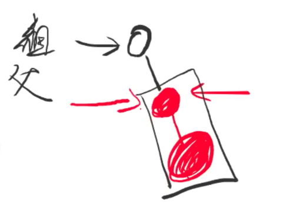
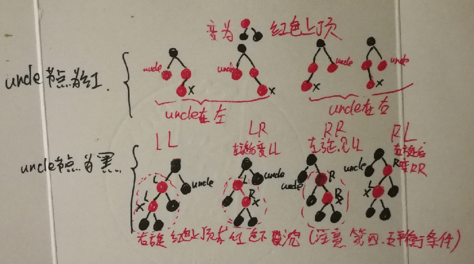

## 二叉排序树

```
二叉树中序遍历为 左子树 根 右子树
可用来查找排名第K个元素 
如果size1(左子树中元素个数) >= k 代表第K大的元素在左子树中
如果size1 == k-1 代表第K大的元素就是根节点
如果size1 < k-1 代表第K大的元素在右子树中
```

二叉查找树插入 ：插在叶子节点


删除 ：

+ 删除度为0的结点直接删除就好
+ 删除度为 1 的结点：直接放在待删除结点的父节点上，直接让待删除结点的唯一子书替代他的位置
+ 删除度为2的结点：
+ 前驱左子树中最右边的结点，后继右子树中最小的结点
+ 前驱(后继)替代待删除结点，在找到并删除重复的这个前驱(后继)，转换成删除度为 1的节点的操作

__缺点:查找效率依赖于元素插入顺序__ 

# 平衡二叉排序树

## AVL

__平衡条件通过树高决定__

__左右子树差距小于等于1，优点：由于对每个节点的左右子树的树高做了限制，所以整棵树不会退化成一个链表__


``` 
BS 和 AVL 高度为为H产生结点范围
BS (H ~ 2^H - 1) H退化成链表 2^H - 1为H层能存放最多节点个数
AVL (1.5^H ~ 2^H - 1)
推导如上图
能产生的最少的节点数为 low(H) = low(H+1) + low(H+2) + 1 => 斐波那契通项公式
接近与1.5^H <= size(H) <= 2^H - 1
H = log1.5n 或 long2n
都是logn级别的
```


## AVL调整操作

__抓着k1左旋，k1变成了左子树__


__抓着k1右旋，k1变右子树__


## AVL失衡调整

LL 左子树的左子树最长 RR 右子树的右子树最长 

LR 左子树的右子树最长 RL右子树的左子树最长 


### LL


### LR

__先左旋再右旋，使其变成LL失衡__


k2 = ha + 2 = d + 2 所以ha =d


__先抓着左子树左旋，在抓着!!!!!!!根节点!!!!!!右旋__


## SB树

__平衡条件通过树节点决定__

# 小技巧

## AVL

```
__attribute__((constructor)) 修饰的函数在main函数之前执行

__attribute__((destructor))  修饰的函数在main函数之后执行
```

```
结构体中，变量定义顺序不同，结构体大小也不同
```

```
写二叉树时，为了避免访问到空结点子树导致段错误，可直接

typedef struct Node {
    int key, h;
    struct Node *lchild, *rchild;
} Node;

Node __NIL;
#define NIL (&__NIL)
__attribute__((constructor))//使其先于主函数执行
void init_NIL() {
    NIL->key = NIL->h = 0;
    NIL->lchild = NIL->rchild = NIL;
    return ;
}
让其先于值函数执行，这样就得到了一个没有底的二叉树
```

# 红黑树

## 平衡条件

+ 每个结点非黑即红 
+ 根节点是黑色
+ 叶节点（NIL）是黑色
+ 如果一个节点是红色，则它的子节点都是黑色的(两个红色节点不能连在一起)
+ 从根节点出发到所有叶节点路径上，黑色结点数量相同

> 针对于第五条平衡条件 
>
> 如果一个红黑树从根节点到叶节点的一条路径上黑色节点的数量为5个(全是黑的，即最短边)，那么也就是说该红黑树中最长的一个路径应为黑-红-黑-红-黑-红-黑-红-黑-红，才能保证每个路径的黑色节点数量都为5，也就是说红黑树最长路径和最短路径的差应小于等于最短路径的2呗，例：最短为5最长为10

> 根据四五条件可以推导出 从路径长度(高度)上作为限制条件，可将其看成树高条件比较松散的AVL树

> 可以通过给AVL树涂颜色将其改成一个红黑树(通过树高信息来判断每个节点颜色) 

__因为相对来讲改颜色比旋转更简单(因为旋转涉及到对每个节点地址的访问)所以工程中影长用红黑数而不是AVL树__

> 地址的访问有份为顺序访问和随机访问，CPU访问变量i时会把i-2,i-1, i,i+1,i+2这五个变量都访问因为它预测下一个访问的变量可能在这里，所以顺序访问i后，CPU就可以直接将i+1读出来，节省了一次去内存提取的时间，而随机访问对CPU来说是未知的，对CPU性能损耗较大，所以顺序访问会比随机访问的效率高


## 调整策略

+ 插入调整站在__祖父节__点上看



+ 删除调整站在__父节__点看


+ 插入和删除的情况处理一种五种

__若想把黑色节点数全部减1，可用以下两种方发，等价__


$\color{red}{！！注意！！此时的15并不是根节点，当前树只是一颗子树。}$

$\color{red}所以不能改变图片中每个路径上的黑色结点数量，改了后，可能包含该子树的红黑树的其他部分黑色节点数量与该子树黑色结点不同，导致不平衡$

## 插入调整(插入之后发生的调整)

$\color{purple}{！！！！！！！！！！！注意从祖父节点向下看，有才调整}$

__主要是将红点上移，如果最后根节点变为红的为了不违反第二条平衡条件，就将其变成黑色的，从根节点到叶节点的每个路径黑色点的数量加1__

> 新插入的节点应该是红色，因为插入红色节点可能会发生冲突(破坏第四个平衡条件)，但如果插入黑色就一定会发生冲突(破坏第五个平衡条件)
>
> 所以我们在插入时只插入红色节点，也就是插入调整主要是消除两个红色节点相邻

### 带插入节点(x)的uncle节点为红色

$\color{green}{插入时主要是根据uncle节点颜色选择具体处理方法}$

__待删除节点还可以在剩余三个位置，处理方法相同__


__现黑色结点数量为1，不能改变数量，所以所做修改如下。__


### 带插入节点(x)的uncle节点为黑色

__带插入节点可在四个位置即LL,LR,RL,RR,下面以LL为例,如果是LR，就先小左旋再大右旋在用相同方法__

> 子树黑色结点数量为2，调整后应该也为2个
>
> 因为是LL类型，所以先右旋，得到下图


> 由图可知，右旋后黑色结点数量不对，应变为原来的2，所以两种调整办法
>
> 一、10改成黑色，该子树上面的三元组变为红黑黑(红色上顶)
>
> 二、15变黑，20变红(前提3,13 19,25为黑色，下面证明)，该子树上面的三元组变为黑红红(红色下沉)
>
> 上面提到过黑红红和红黑黑是等价的

__判断节点颜色：10 15 一定红所以3 13一定黑，25一定黑 20一定黑(不可能三个红连在一起) 19一定黑，17不确定什么色 ，由此可见第二种方法是可以的__


## 删除调整()

__主要是将双重黑色上移，如果最后根节点变为双重黑，就将其直接减1，从根节点到叶节点的每个路径黑色点的数量减1__

### 双重黑(一个双重黑算两个黑色节点)

> 删除分为删除度为0,1,2的结点，但是度为2的节点可以转化为删除度为1 的节点，所以只考虑删除度为0或1的节点

__删除度为0的节点__


> 如下图所示若想删除C，就会发现删除后左子树黑色结点数量为2右子树为1，所以引进双重黑概念，运用了平衡条件的第三条NIL虚拟的节点并且默认为黑色，就相当于删除C后NIL就是一个双重黑


__删数度为1的节点__

> 直接将待删除节点的子孩子黑色加1即可，如果子孩子为红，则变为黑色，如果为黑，则变为双重黑


——————————————————————————————————————————————————

> 删除调整就是为了解决双重黑结点，删除度为0的节点一定产生双重黑或删除度为1的节点可能产生双重黑

> 如下图所示分为删除度为0,1 的红色黑色结点四种情况，因为删除度为0或1 的红色结点并不会改变每个路径上黑色节点的数量也不会改变其他平衡条件，所以删除红色度为0或1 的节点并不会对红黑树造成影响，下面就直接讨论删除度为0或1的黑色节点出现的情况


$\color{purple}{！！！！！！！！！！！注意从父节点向下看，有才调整}$

$\color{green}{根据brother节点颜色选择具体处理方法}$

### 待删除节点的brother节点为黑色

#### 黑黑无红

__待删除节点的兄弟节点子树没有红色节点__


> 删除视为了消灭双重黑，消灭双重黑最好的办法就让双重黑上移，移动到真正的根节点时，将变为双重黑的根节点减1
>
> 所以当待删除节点的兄弟节点子树没有红色节点时，应让双重黑节点上移一位
>
> 即9变成红色(-1)，95变成正常黑(-1)，如果父节点43为黑色(+1)，那么父节点变为双重黑，如果父节点43为红色(+1)，那么父节点变为黑色

__节点颜色判断：95双重黑 9黑 5,13黑(情况为brother无红节点) 父节点43不一定什么色(特例)__


#### 黑黑子右红(RR)

__待删除节点的兄弟节点在右(R)为黑且右子树(R)为红__


> RR类型，应先左旋变为右侧的图(蓝框代表颜色不确定)，
>
> 将三元组变为下面的两个变为黑色上面的节点为旋转前根节点的颜色，即51变红色(38的颜色) 38变黑 72变黑 双重黑减1

__节点颜色判断：28 黑，51黑，72红则64,85一定是红 ，其他都不确定__


#### 黑黑子左红(RL)

__待删除节点的兄弟节点在右(R)为黑且左子树为红(L)__


> RL 所以先右旋，变为右侧的图，因为原来黑色节点的数为2，现在左侧黑色节点数为1，所以51变黑色，此时右边子树黑色结点数量变为3，多了一个，因为64 85一定是黑色，所以将72变为红色

__结点颜色判断：28双重黑 72黑 51红(RL)则48 64都为黑 85一定为黑，因为如果85为黑就是RR了__

> 然后把旋转并修改好的38的右子树放回去就变成了RR类型，然后用RR类型解决方式解决


## 待删除节点的兄弟节点为红


> 右上角为原图，即兄弟节点为红色的情况，因为兄弟节点在右，所以先进行 左旋，得到左下角的图。左旋后进行节点判断

__结点颜色判断：28双重黑，72红(兄弟节点为红) 则51,85，38一定为黑(两个红的不能在一起)，其他颜色不一定__

> 左旋前黑色节点数量为3，左旋后为左子树仍为3，但是右子树为2，因为28 51一定为黑所以将38变红，72变黑
>
> 因为删除调整要从父节点上看，所以为了消除双重黑应站在38节点上看，就会发现他现在是一个兄弟节点为黑的情况，可以用兄弟节点为黑的情况解决


## 小结

__兄弟节点为黑色的情况，以兄弟节点在左边为例，黑黑：左右子树都为黑，黑红：左子树黑右子树红(LR)__





+ 红黑树最长边和最短边之间的差距最长为2倍
+ 因为红黑数相对于AVL树来讲,红黑树在树高的方面控制的比较松散,所以插入元素或者删除平衡调整中,红黑树旋转操作较少,也就是更少的随机访问, 所以说红黑树的综合性能略优于AVL树

## 代码

```c
#include <stdio.h>
#include <stdlib.h>
#include <time.h>

#define RED 0
#define BLACK 1
#define DBLACK 2

typedef struct Node {
    int key;//数据字段
    int color;//0 red 1 black 2 double black
    struct Node *lchild, *rchild;//指针字段
} Node;

Node __NIL;
#define NIL (&__NIL)//可想象成指针

__attribute__((constructor))//执行在main函数之前
void init_NIL() {//NIL 的初始化
    NIL->key = 0;
    NIL->lchild = NIL->rchild = NIL;
    NIL->color = BLACK;
    return ;
}

Node *getNewNode(int key) {
    Node *p = (Node *)malloc(sizeof(Node));
    p->key = key;
    p->lchild = p->rchild = NIL;//NIL 的孩子结点也都为NIL
    p->color = RED;//默认插入红色
    return p;
}

bool has_red_child(Node *root) {
    //看当前节点的孩子节点中是否有红色的
    return root->lchild->color == 0 || root->rchild->color == 0;
}

Node *left_rotate(Node *root) {//左旋
    Node *temp = root->rchild;
//让原根节点的右子树作为左旋后的结点,即temp指向右孩子
    root->rchild = temp->lchild;
//把temp的左孩子放到根节点的右孩子的位置
    temp->lchild = root;
    return temp;
}

Node *right_rotate(Node *root) {//右旋
    Node *temp = root->lchild;
    root->lchild = temp->rchild;
    temp->rchild = root;
    return temp;
}

//root为祖父结点
Node *insert_maintain(Node *root) {
    if (!has_red_child(root)) return root;
    if (root->lchild->color == RED && root->rchild->color == RED) {
//将黑红红变为红黑黑,
//因为插入的第一种情况即uncle节点为红调整方法就是将三元组变为红黑黑,
//而第二种情况即uncle节点为黑的调整方法一种是变为红黑黑或黑红红
        root->color = RED;
        root->lchild->color = root->rchild->color = BLACK;
        return root;
    }
    //uncle节点为黑色
    if (root->lchild->color == RED) {
        if (!has_red_child(root->lchild)) return root;//没冲突
        if (root->lchild->rchild->color == RED) {//LR
            root->lchild = left_rotate(root->lchild);
        }
        root = right_rotate(root);//LL
    } else {
        if (!has_red_child(root->rchild)) return root;
        if (root->rchild->lchild->color == RED) {//RL
            root->rchild = right_rotate(root->rchild);
        }
        root = left_rotate(root);//RR
    }
    root->color = RED;
    //调整颜色
    root->lchild->color = root->rchild->color = BLACK;
    return root;
}

Node *predeccessor(Node *root) {
    Node *temp = root->lchild;
    while (temp->rchild != NIL) temp = temp->rchild;
    return temp;
}

Node *eraser_maintian(Node *root) {
    if (root->lchild->color != DBLACK && 
        root->rchild->color != DBLACK) return root;
    //第一个if如果根节点下没有双重黑句不用调整
    if (has_red_child(root)) {//兄弟节点为红
        //有双重黑且根节点有红孩子
        root->color = RED;
        if (root->lchild->color == RED) {//uncle为红在左,就应该进行右旋,右旋后左子树黑色结点少一个所以需要调整颜色,最后右子树中就会出现兄弟节点为黑色的情况所以erasr_maintain(root->rchild)
            root = right_rotate(root);
            root->rchild = eraser_maintian(root->rchild);
        } else {
//uncle为红在右,应先左旋后,向下走变为uncle节点为黑的情况
            root = left_rotate(root);
            root->lchild = eraser_maintian(root->lchild);
    //左旋后右子树黑色结点数量需要调整
        }
        root->color = BLACK;
        //调节方法为原根节点变红,旋转后根节点变黑,所以也可以分开写成105行和115行
        return root;
    } 
    //兄弟节点为黑且无红孩子
    if ((root->lchild->color == DBLACK && !has_red_child(root->rchild)) || 
        (root->rchild->color == DBLACK && !has_red_child(root->lchild))) {
        root->color += 1;//情况一黑黑,三元组变一下即可目的是让双重黑向上走
        root->lchild->color -= 1;//所以根节点加1 左右子树减1
        root->rchild->color -= 1;
        return root;
    }
    //兄弟节点为黑且有红孩子
    if (root->rchild->color == BLACK) {//兄弟节点在右
        if (root->rchild->rchild->color != RED) {//RL,不能用root->rchild->lchild == RED来判断,因为只要右子树为红就是RR 
            root->rchild->color = RED;
            root->rchild = right_rotate(root->rchild);
            root->rchild->color = BLACK;
            //右旋后应该一个旋转后跟变黑,旋转前跟变红分开写成130行 132行
        }
//RR 调整方法为左旋后的根节点变为原来根节点的颜色,左右孩子变黑色
        root->rchild->color = root->color;//变为原来根的颜色
        root->color = BLACK;//左旋后的左子树即使原根节点变黑
        root->lchild->color -= 1;
        root = left_rotate(root);
        root->rchild->color = BLACK;//旋转后右子树也变黑
    } else {//兄弟节点在左
        if (root->lchild->lchild->color != RED) {//LR
            root->lchild->color = RED;
            root->lchild = left_rotate(root->lchild);
            root->lchild->color = BLACK;
        }
        root->lchild->color = root->color;
        root->color = BLACK;
        root->rchild->color -= 1;
        root = right_rotate(root);
        root->lchild->color = BLACK;       
    }
    return root;
}

Node *__erase(Node *root, int key) {
    if (root == NIL) return root;
    if (root->key > key) {
        root->lchild = __erase(root->lchild, key);
    } else if (root->key < key) {
        root->rchild = __erase(root->rchild, key);
    } else {
        if (root->lchild == NIL || root->rchild == NIL) {
            Node *temp = root->lchild == NIL ? root->rchild : root->lchild;
            temp->color += root->color;
            free(root);
            return temp;
        } else {
            Node *temp = predeccessor(root);
            root->key = temp->key;
            root->lchild = __erase(root->lchild, temp->key);
        }
    }
    return eraser_maintian(root);
}

Node *erase(Node *root, int key) {//包装,确保删除后跟结点为黑色
    root = __erase(root, key);
    root->color = BLACK;
    return root;
}

Node *__insert(Node *root, int key) {
    if (root == NIL) return getNewNode(key);
    if (root->key == key) return root;
    if (root->key > key) {
        root->lchild = __insert(root->lchild, key);
    } else {
        root->rchild = __insert(root->rchild, key);
    }
    return insert_maintain(root);
}

//包装一层，防止根节点为红色,保证根节点一定是黑色
Node *insert(Node *root, int key) {
    root = __insert(root, key);
    root->color = BLACK;
    return root;
}

void clear(Node *root) {
    if (root == NIL) return ;
    clear(root->lchild);
    clear(root->rchild);
    free(root);
    return ;
}

void output(Node *root) {
    if (root == NIL) return ;
    printf("(%d | %d, %d, %d)\n", 
        root->color, 
        root->key,
        root->lchild->key,
        root->rchild->key
    );
    output(root->lchild);
    output(root->rchild);
    return ;
}

int main() {
    int op, val;
    Node *root = NIL;
    while (~scanf("%d%d", &op, &val)) {
        switch (op) {
            case 0: root = insert(root, val);break;
            case 1: root = erase(root, val); break;
        }
        output(root);
    }
    return 0;
}
```

